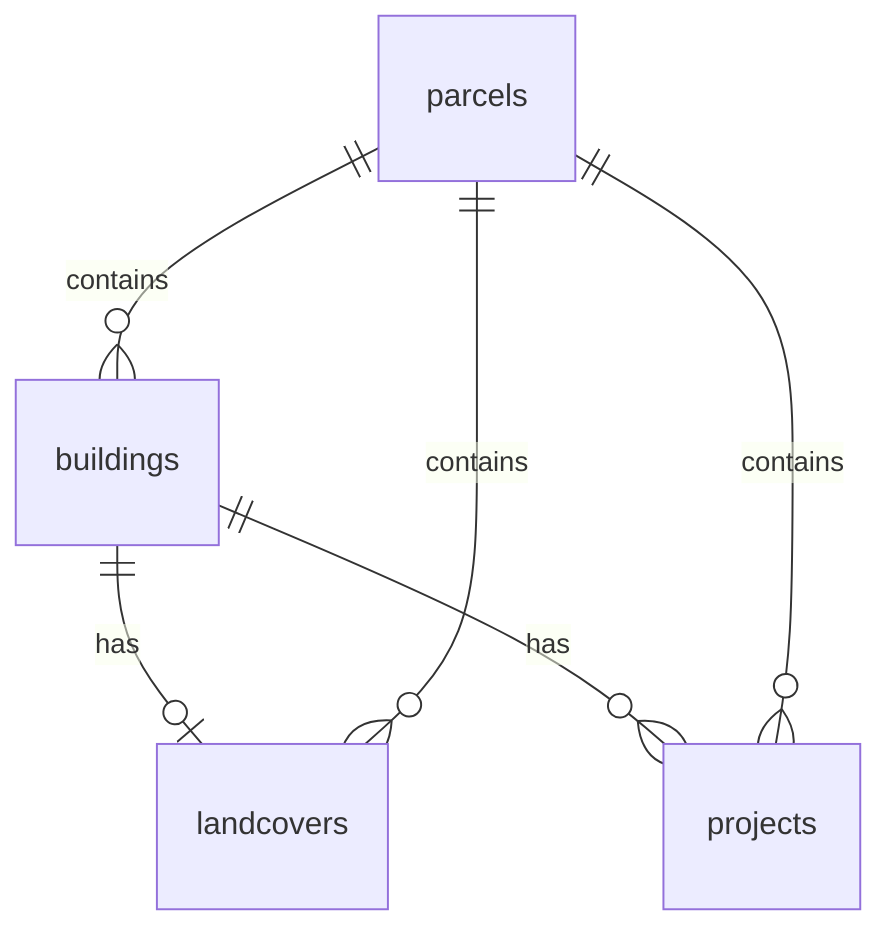

# OpenBuildings.ch

**Swiss building data. Open by default. Open in practice.**


[](LICENSE)
[](https://davras5.github.io/OpenBuildings/)
[](https://www.python.org/)
[](https://supabase.com/)
[](https://opendata.swiss/)

---

## Overview

**Live demo:** [https://davras5.github.io/OpenBuildings/](https://davras5.github.io/OpenBuildings/)

OpenBuildings is a **shared, open foundation for Swiss building data**.

It consolidates Switzerland’s most relevant public building datasets into a **consistent, reproducible reference layer** for:

* planning and scenario analysis
* reporting and monitoring
* portfolio and territorial comparisons
* research and public-sector decision-making

This is not a one-off dataset.
It is **data infrastructure**.

---

## Why It Matters

Buildings account for **~40% of Switzerland’s CO₂ emissions**.
Every credible path to net zero runs through the building stock.

Yet today:

* Data is fragmented across sources and levels
* Methods are reimplemented again and again
* Results remain siloed, undocumented, and short-lived

You cannot decarbonize what you cannot measure.
And you cannot coordinate what you cannot compare.

**A shared foundation changes that:**

* One reference layer, used by many actors
* Comparable results across communes, cantons, and portfolios
* Transparent methods instead of black boxes

Public data. Public methods. Public value — multiplied.

---

## What You Can Do With It

### Explore

* Interactive **2D / 3D web map**
* Address search via Swisstopo
* Building- and parcel-level attributes
* Multiple basemaps and terrain views


### Analyze

* Calculate building volumes and roof characteristics
* Enrich footprints with height, area, and energy-relevant metrics
* Reproduce results across territories

### Build On Top

* Use the database and API as a reference layer
* Extend processing tools for new indicators
* Integrate into reports, dashboards, or planning workflows

---

## Architecture

| Component            | Description                                       |
| -------------------- | ------------------------------------------------- |
| **Web App**          | Static frontend for exploration and visualisation |
| **Backend**          | PostgreSQL + PostGIS with REST API (Supabase)     |
| **Processing Tools** | Python & FME workers for data enrichment          |

---

## Tools

| Tool                                            | Purpose                                                  |
| ----------------------------------------------- | -------------------------------------------------------- |
| [**Volume Estimator**](tools/volume-estimator/) | Calculate building volumes from terrain & surface models |
| [**Roof Estimator**](tools/roof-estimator/)     | Derive roof characteristics                              |
| [**Base Worker**](tools/base-worker/)           | Template for new processing pipelines                    |

### Example: Volume Estimator

```bash
pip install geopandas rasterio numpy pandas shapely fiona

python tools/volume-estimator/python/main.py \
  data/av_2056.gpkg data/alti3d data/surface3d \
  --limit 100 \
  --bbox 2680000 1235000 2681000 1236000 \
  -o results.csv \
  -g buildings_with_volumes.gpkg
```

See the tool-specific README for full details.

---

## Data Model

Full schema: [documentation/DATAMODEL.md](documentation/DATAMODEL.md)

The platform aggregates Swiss Open Government Data into four core entities:



### Buildings

* Identification: EGID, address, location
* Classification: status, category, class
* Geometry & size: footprint, heights, floors, volume, floor area
* Energy: heating type and source
* Heritage: KGS protection category

### Parcels

* Identification: E-GRID, parcel number
* Area metrics: parcel, footprint, sealed area
* Zoning: main zone and zone type

---

## Data Sources

Primary access via the **Federal Spatial Data Infrastructure (FSDI)** / geo.admin.ch.

| Source           | Provider  | Content                         |
| ---------------- | --------- | ------------------------------- |
| GWR              | BFS       | Building attributes & addresses |
| AV               | Cantons   | Parcels, footprints, landcover  |
| swissALTI3D      | swisstopo | Terrain model (DTM)             |
| swissSURFACE3D   | swisstopo | Surface model (DSM)             |
| swissBUILDINGS3D | swisstopo | 3D building models              |
| ARE              | ARE       | Zoning                          |
| KGS              | BABS      | Heritage protection             |

All sources are **Swiss Open Government Data**.

---

## Methods & Standards

### Coordinate System

* WGS 84 (EPSG:4326)

### Volume Calculation (Simplified)

1. Generate a 1×1 m grid inside each footprint
2. Sample terrain height (DTM)
3. Sample surface height (DSM)
4. Compute volume as
   `Σ (surface − terrain) × 1 m²`

### Standards Referenced

* SIA 416
* GWR Merkmalskatalog 4.2
* DM.01-AV-CH

---

## Project Structure

```
OpenBuildings/
├── documentation/
├── tools/
│   ├── volume-estimator/
│   ├── roof-estimator/
│   └── base-worker/
├── images/
├── index.html
└── LICENSE
```

---

## Principles

* **Open by default** — data, methods, assumptions
* **Reproducible** — same inputs, same outputs
* **Interoperable** — standards-based, tool-agnostic
* **Infrastructure-first** — long-lived, not project-bound

---

## Sustainability Model

| Tier     | Access                                   |
| -------- | ---------------------------------------- |
| **Free** | Exploration and individual downloads     |
| **Paid** | Bulk data, APIs, portfolio-level outputs |

Revenue supports maintenance and continuity.
The foundation remains open.

---

## Contributing

OpenBuildings is a shared foundation.

Use it. Question it. Improve it.

1. Fork the repository
2. Create a feature branch
3. Commit your changes
4. Open a pull request

---

## License

MIT License — see [LICENSE](LICENSE).

---

## Links

* Website: [https://openbuildings.ch](https://openbuildings.ch)
* Demo: [https://davras5.github.io/OpenBuildings/](https://davras5.github.io/OpenBuildings/)
* GitHub: [https://github.com/davras5/OpenBuildings](https://github.com/davras5/OpenBuildings)

---

*Building data is a public good.
OpenBuildings turns that principle into infrastructure.*

---

If you want, next we can:

* Make a **short “Executive README”** (1-page version)
* Add a **“Who is this for?”** section (public sector / planners / researchers)
* Align wording explicitly with **ISO 19650 / PIM / AIM thinking**
