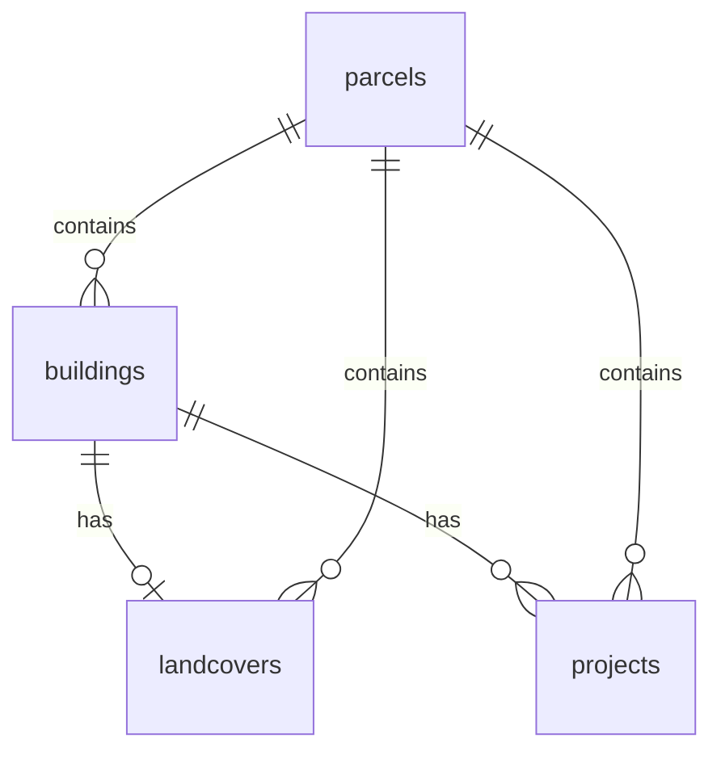

# OpenBuildings.ch

**Swiss building data. Open by default. Open in practice.**


[](LICENSE)
[](https://davras5.github.io/OpenBuildings/)
[](https://www.python.org/)
[](https://supabase.com/)
[](https://opendata.swiss/)

---

## Overview

OpenBuildings is developed and maintained by the **Department for Digital Real Estate** at the Federal Office of Buildings and Logistics (FOBL / BBL). While primarily supporting internal federal needs, the project is openly published to enable **reuse, transparency, and collaboration** beyond organizational boundaries.

**Important:** The Federal Office **does not own the underlying data** and cannot guarantee its correctness. We aggregate, harmonize, and link data from official sources. For authoritative datasets, see [opendata.swiss](https://opendata.swiss/de) or our documentation.

OpenBuildings brings together publicly available building data from multiple sources and aligns it into a single, **consistent reference layer**. The goal is not to replace existing registers but to make building data **usable in practice** across organizational and system boundaries.

**Live demo:** [https://davras5.github.io/OpenBuildings/](https://davras5.github.io/OpenBuildings/)

---

## What OpenBuildings Is

OpenBuildings is an **open building data foundation for Switzerland**. It provides a harmonized dataset and structure that:

* Combines building-related information from multiple public sources
* Aligns schemas, identifiers, and attributes where possible
* Enables comparison, enrichment, and integration across datasets

---

## What OpenBuildings Is NOT

OpenBuildings is **not**:

* An official or legally authoritative building register
* A replacement for cantonal or municipal source systems
* A single “source of truth” for regulatory or legal decisions
* A closed or proprietary platform

Instead, it **complements existing registers** by improving interoperability and practical reuse while remaining open, transparent, and extensible.

---

## Data Sources & Openness

OpenBuildings is built entirely on **publicly available data** from authoritative sources. All original licensing conditions are respected and documented.

**Key principles:**

* No proprietary source data
* Transparent provenance
* Reproducible processing

The project follows an **open-by-default** approach to **data, code, and documentation**.

---

## Architecture

| Component            | Description                                       |
| -------------------- | ------------------------------------------------- |
| **Web App**          | Static frontend for exploration and visualization |
| **Backend**          | PostgreSQL + PostGIS with REST API (Supabase)     |
| **Processing Tools** | Python & FME workers for data enrichment          |

---

## Tools

OpenBuildings provides modular tools for data processing.

| Tool                                            | Status         | Purpose                                                   |
| ----------------------------------------------- | -------------- | --------------------------------------------------------- |
| [**Base Worker**](tools/base-worker/)           | Available      | Aggregates core data like IDs, geometry, and measurements |
| [**Volume Estimator**](tools/volume-estimator/) | Available      | Calculates building volumes from terrain & surface models |
| [**Roof Estimator**](tools/roof-estimator/)     | In development | Derives roof characteristics                              |
| **Biodiversity**                                | Idea           | Green roof detection and biodiversity index per parcel    |
| **Carbon Risks**                                | Idea           | Location data for carbon risk assessment                  |
| **Environmental Risks**                         | Idea           | Location data for environmental risk assessment           |

### Example: Volume Estimator

```bash
pip install geopandas rasterio numpy pandas shapely fiona

python tools/volume-estimator/python/main.py \
  data/av_2056.gpkg data/alti3d data/surface3d \
  --limit 100 \
  --bbox 2680000 1235000 2681000 1236000 \
  -o results.csv \
  -g buildings_with_volumes.gpkg
```

See each tool's README for full details.

---

## Data Model

Full schema: [documentation/DATAMODEL.md](documentation/DATAMODEL.md)

OpenBuildings aggregates Swiss Open Government Data into four core entities:



### Buildings

* Identification: EGID, address, location
* Classification: status, category, class
* Geometry & size: footprint, heights, floors, volume, floor area
* Energy: heating type and source
* Heritage: KGS protection category

### Parcels

* Identification: E-GRID, parcel number
* Area metrics: parcel, footprint, sealed area
* Zoning: main zone and zone type

---

## Data Sources

Primary access via the **Federal Spatial Data Infrastructure (FSDI)** / geo.admin.ch.

| Source           | Provider  | Content                         |
| ---------------- | --------- | ------------------------------- |
| GWR              | BFS       | Building attributes & addresses |
| AV               | Cantons   | Parcels, footprints, landcover  |
| swissALTI3D      | swisstopo | Terrain model (DTM)             |
| swissSURFACE3D   | swisstopo | Surface model (DSM)             |
| swissBUILDINGS3D | swisstopo | 3D building models              |
| ARE              | ARE       | Zoning                          |
| KGS              | BABS      | Heritage protection             |

All sources are **Swiss Open Government Data**.

---

## Methods & Standards

### Coordinate System

* WGS 84 (EPSG:4326)

### Volume Calculation (Simplified)

1. Generate a 1×1 m grid inside each footprint
2. Sample terrain height (DTM)
3. Sample surface height (DSM)
4. Compute volume as:
   `Σ (surface − terrain) × 1 m²`

### Standards Referenced

* SIA 416
* GWR Merkmalskatalog 4.2
* DM.01-AV-CH

---

## Project Structure

```
OpenBuildings/
├── documentation/
├── tools/
│   ├── volume-estimator/
│   ├── roof-estimator/
│   └── base-worker/
├── images/
├── index.html
└── LICENSE
```

---

## Principles

* **Open by default** — data, methods, assumptions
* **Reproducible** — same inputs, same outputs
* **Interoperable** — standards-based, tool-agnostic
* **Infrastructure-first** — long-lived, not project-bound

---

## Contributing

OpenBuildings is a shared foundation. Use it. Question it. Improve it.

1. Fork the repository
2. Create a feature branch
3. Commit your changes
4. Open a pull request

---

## License

MIT License — see [LICENSE](LICENSE)

---

## Links

* Website: [https://openbuildings.ch](https://openbuildings.ch)
* Demo: [https://davras5.github.io/OpenBuildings/](https://davras5.github.io/OpenBuildings/)
* GitHub: [https://github.com/davras5/OpenBuildings](https://github.com/davras5/OpenBuildings)

---

*Building data is a public good. OpenBuildings turns that principle into infrastructure.*

---
