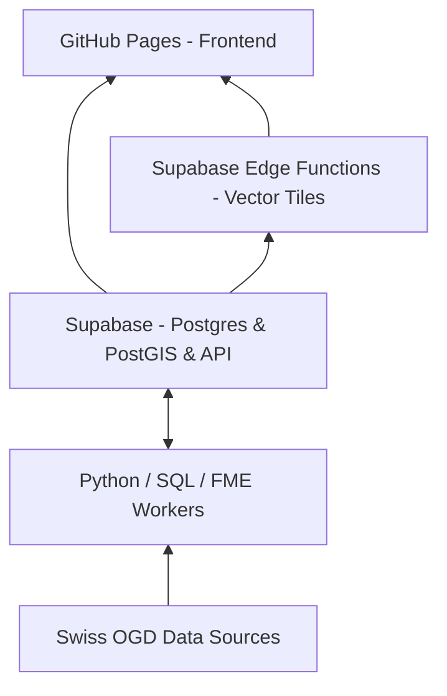
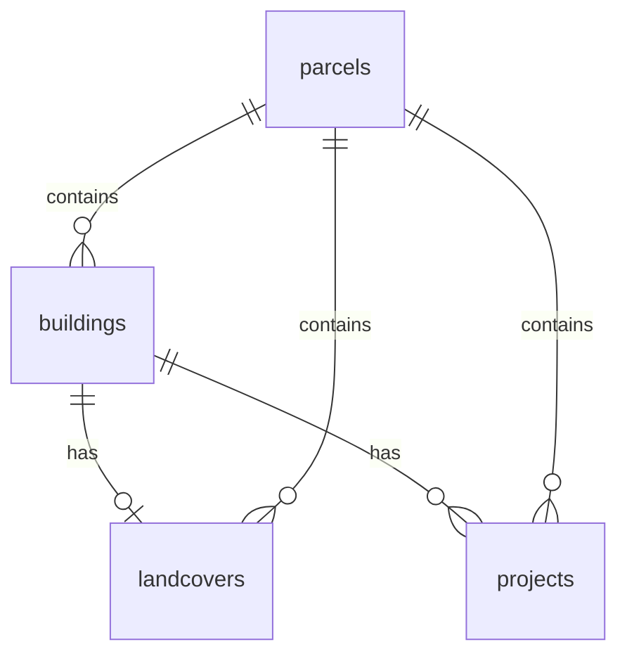

# OpenBuildings.ch

**Swiss building data. Open by default. Open in practice.**


[](LICENSE)
[](https://davras5.github.io/OpenBuildings/)
[](https://www.python.org/)
[](https://supabase.com/)
[](https://opendata.swiss/)

---

## Overview

OpenBuildings is a no build, vanilla JS web application developed and maintained by the **Department for Digital Real Estate** at the Federal Office of Buildings and Logistics (FOBL / BBL). While primarily supporting internal federal needs, the project is openly published to enable **reuse, transparency, and collaboration** beyond organizational boundaries.

> **Important:** The Federal Office **does not own the underlying data** and cannot guarantee its correctness. We aggregate, harmonize, and link data from official sources. For authoritative datasets, see [opendata.swiss](https://opendata.swiss/de) or our documentation.

OpenBuildings brings together publicly available building data from multiple sources and aligns it into a single, **consistent reference layer**. The goal is not to replace existing registers but to make building data **usable in practice** across organizational and system boundaries.

**Live demo:** [https://davras5.github.io/OpenBuildings/](https://davras5.github.io/OpenBuildings/)

---

## What OpenBuildings Is

OpenBuildings is an **open building data foundation for Switzerland**. It provides a harmonized dataset and structure that:

* Combines building-related information from multiple public sources
* Aligns schemas, identifiers, and attributes where possible
* Enables comparison, enrichment, and integration across datasets

---

## What OpenBuildings Is NOT

OpenBuildings is **not**:

* An official or legally authoritative building register
* A replacement for cantonal or municipal source systems
* A single “source of truth” for regulatory or legal decisions
* A closed or proprietary platform

Instead, it **complements existing registers** by improving interoperability and practical reuse while remaining open, transparent, and extensible.

---

## Principles

* **Open by default** — data, methods, assumptions
* **Reproducible** — same inputs, same outputs
* **Interoperable** — standards-based, tool-agnostic
* **Infrastructure-first** — long-lived, not project-bound

OpenBuildings is built entirely on **publicly available data** from authoritative sources. All original licensing conditions are respected and documented.

---

## Architecture

| Component            | Description                                       |
| -------------------- | ------------------------------------------------- |
| **Frontend**          | Single page Vanilla JS + MapLibre GL JS and Protomaps to visualize geospatial data |
| **Backend**          | PostgreSQL + PostGIS with REST API (Supabase)     |
| **Data Processing Tools** | Python, SQL & FME workers for data enrichment     |



---

## Modular Data Processing Tools

OpenBuildings provides modular tools for data processing.

| Tool                                            | Status         | Purpose                                                   |
| ----------------------------------------------- | -------------- | --------------------------------------------------------- |
| [**Base Worker**](tools/base-worker/)           | Available      | Aggregates core data like IDs, geometry, and measurements |
| [**Volume Estimator**](tools/volume-estimator/) | Available      | Calculates building volumes from terrain & surface models |
| [**Roof Estimator**](tools/roof-estimator/)     | In development | Derives roof characteristics                              |
| **Biodiversity**                                | Idea           | Biodiversity index per parcel and Green roof potential   |
| **Carbon Risks**                                | Idea           | Location data for carbon risk assessment                  |
| **Environmental Risks**                         | Idea           | Location data for environmental risk assessment           |

See each tool's README for full details: [tools](tools/)

---

## Data Model

Full schema: [documentation/DATAMODEL.md](documentation/DATAMODEL.md)

OpenBuildings aggregates Swiss Open Government Data into four core entities:



| Entity         | Description                                                       | Master System / Source            |
| -------------- | ----------------------------------------------------------------- | --------------------------------- |
| **Parcels**    | Land parcels with IDs, area, zoning, footprint                    | Cantonal cadastral registers (AV) |
| **Buildings**  | Buildings with addresses, geometry, volume, heritage, energy info | AV / GWR (BFS)      |
| **Landcovers** | Landcover classification and areas per parcel/building            | AV / swissSURFACE3D               |
| **Projects**   | Building-related projects or initiatives                          | GWR (BFS) / derived              |

---

## Data Sources & Licensing

Primary access via the **Federal Spatial Data Infrastructure (FSDI)** / geo.admin.ch.

| Source | Provider | Content | License |
| ------ | -------- | ------- | ------- |
| [GWR](https://www.housing-stat.ch/) | BFS | Building attributes & addresses | OGD |
| [Geodienste.ch / AV](https://www.geodienste.ch/services/av) | Cantons | Parcels, footprints, landcover | OGD / CC BY |
| [swissALTI3D](https://www.swisstopo.admin.ch/de/hoehenmodell-swissalti3d) | swisstopo | Terrain model (DTM) | OGD |
| [swissSURFACE3D](https://www.swisstopo.admin.ch/de/hoehenmodell-swisssurface3d) | swisstopo | Surface model (DSM) | OGD |
| [swissBUILDINGS3D](https://www.swisstopo.admin.ch/de/geodata/height/buildings3d.html) | swisstopo | 3D building models | OGD |
| [Bauzonen](https://www.are.admin.ch/bauzonen) | ARE | Zoning | OGD |
| [KGS Inventar](https://www.babs.admin.ch/de/aufgabenbabs/kgs/inventar.html) | BABS | Heritage protection | OGD |

All sources are **Swiss Open Government Data** — free for commercial and non-commercial use with attribution.

→ **Detailed licensing & attribution:** [documentation/DATAMODEL.md](documentation/DATAMODEL.md#data-licensing--attribution)

### Attribution

When using OpenBuildings data, please credit:
```
Datenquellen: BFS (GWR), © swisstopo, Amtliche Vermessung via geodienste.ch, ARE, BABS
```

---

## Project Structure

```
OpenBuildings/
├── documentation/
├── tools/
│   ├── volume-estimator/
│   ├── roof-estimator/
│   └── base-worker/
├── images/
├── index.html
└── LICENSE
```
## License

MIT License — see [LICENSE](LICENSE)

---

*Building data is a public good. OpenBuildings turns that principle into infrastructure.*

---
