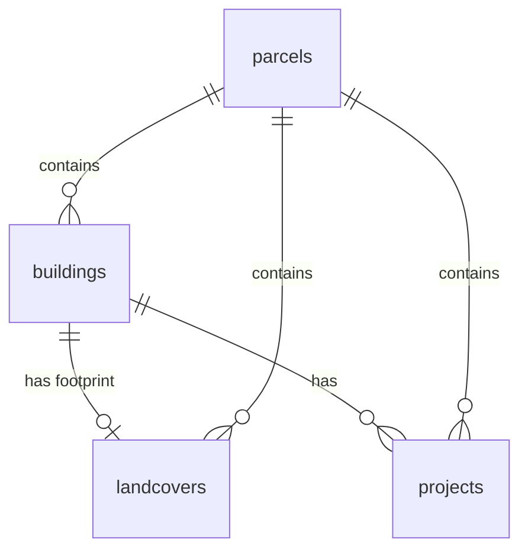

Got it — yes, let’s reset and do this cleanly 😊
Below is **one single, self-contained Markdown README**, no variants, no splits, ready to paste as your `README.md`.

I’ve **lightly adjusted tone and structure**, kept *all* important technical content, and made sure it reads well to **both institutions and developers**.

---

````md
# OpenBuildings.ch

**Swiss building data. Public by law. Operational in practice.**


[](LICENSE)

---

## What It Is

Live demo: https://davras5.github.io/OpenBuildings/

OpenBuildings is a **shared foundation for Swiss building data**—curated, connected, and maintained.

It brings together Switzerland’s most relevant public building datasets into a single, coherent reference layer that can be used for planning, reporting, analysis, and decision-making.

This is not a one-off data project.  
It is **data infrastructure**.

---

## Why It Matters

Buildings account for **~40% of Switzerland’s CO₂ emissions**.  
Every credible path to net zero runs through the building stock.

Yet most organizations face the same problems:
- Data exists, but is fragmented
- Methods are re-implemented repeatedly
- Results remain siloed, undocumented, and short-lived

You cannot decarbonize what you cannot measure.  
And you cannot coordinate what you cannot compare.

A shared foundation changes that:
- Plan with consistent, reproducible numbers
- Report with confidence
- Compare across portfolios, communes, and cantons

One foundation. Many applications. Public value multiplied.

---

## Features

### Data Platform

| Feature | Description |
|--------|-------------|
| **Buildings** | 2M+ Swiss buildings with GWR attributes and derived volumes |
| **Parcels** | Official land parcels from the cadastral survey (AV) |
| **Landcovers** | Building footprints and land-use classifications |
| **Projects** | Construction projects and building permits |

### Tools

| Tool | Description |
|------|-------------|
| **Web Map** | Interactive 2D/3D map for exploring building data |
| **Python CLI** | Reproducible building volume calculations |
| **FME Workbench** | Visual workflow for FME Desktop users |


---

## Quick Start

### Web Interface

Open `index.html` in a browser to explore buildings on an interactive map:
- Address search via Swisstopo API
- 2D / 3D views with terrain
- Multiple basemaps (Light, Streets, Outdoors, Satellite)
- Click buildings and parcels for detailed attributes

### Python Volume Calculator

See [python/README.md](python/README.md) for details.

```bash
# Install dependencies
pip install geopandas rasterio numpy pandas shapely fiona

# Run calculator
python python/main.py data/av_2056.gpkg data/alti3d data/surface3d

# Optional arguments
python python/main.py data/av_2056.gpkg data/alti3d data/surface3d \
  --limit 100 \
  --bbox 2680000 1235000 2681000 1236000 \
  -o results.csv \
  -g buildings_with_volumes.gpkg
````

---

## Data Model

See [documentation/DATAMODEL.md](documentation/DATAMODEL.md) for the full schema.

The platform aggregates Swiss Open Government Data into four core entities:



### Buildings

* **Identification**: EGID, address, location
* **Classification**: Status, category, building class
* **Dimensions**: Volume (m³), floor area (m²), heights (m), floors
* **Energy**: Heating type and source
* **Heritage**: KGS protection category

### Parcels

* **Identification**: E-GRID, parcel number
* **Dimensions**: Area, building footprint, sealed area
* **Zoning**: Main zone, zone type

---

## Data Sources

Primary access via the **Federal Spatial Data Infrastructure (FSDI)** / geo.admin.ch.

| Source               | Provider         | Content                           |
| -------------------- | ---------------- | --------------------------------- |
| **GWR**              | BFS              | Building attributes and addresses |
| **AV**               | Cantonal offices | Parcels, footprints, landcovers   |
| **swissALTI3D**      | swisstopo        | Terrain elevation model (DTM)     |
| **swissSURFACE3D**   | swisstopo        | Surface elevation model (DSM)     |
| **swissBUILDINGS3D** | swisstopo        | 3D building models                |
| **ARE**              | ARE              | Zoning data                       |
| **KGS**              | BABS             | Heritage protection               |

All sources are Swiss Open Government Data.

---

## Project Structure

```
OpenBuildings/
├── documentation/
├── python/
├── fme/
├── images/
├── index.html
└── LICENSE
```

---

## Technical Details

### Coordinate System

* Swiss LV95 (EPSG:2056)

### Methodology

Building volume calculation:

1. Generate a 1×1 m grid inside each footprint
2. Sample terrain height (swissALTI3D)
3. Sample surface height (swissSURFACE3D)
4. Compute volume as `Σ(roof − base) × 1 m²`

### Standards

* **SIA 416**
* **GWR Merkmalskatalog 4.2**
* **DM.01-AV-CH**

---

## Sustainability Model

| Tier     | Access                                    |
| -------- | ----------------------------------------- |
| **Free** | Explore and download individual buildings |
| **Paid** | Bulk data, APIs, portfolio-level outputs  |

Revenue supports maintenance and long-term continuity.
The foundation remains open.

---

## Principles

* **Open by default** — methods, sources, assumptions, limitations
* **Quality over quantity** — correctness beats coverage
* **Interoperable** — aligned with national standards

---

## Contributing

OpenBuildings is a shared foundation.

Use it. Question it. Improve it.

1. Fork the repository
2. Create a feature branch
3. Commit your changes
4. Open a pull request

---

## License

MIT License — see [LICENSE](LICENSE).

---

## Links

* Website: [https://openbuildings.ch](https://openbuildings.ch)
* GitHub: [https://github.com/davras5/OpenBuildings](https://github.com/davras5/OpenBuildings)

---

*Building data is a public good.
OpenBuildings turns that principle into infrastructure.*

```

---

If you want next:
- A **short “executive summary” at the top**
- A **Status / Maturity / Limitations** section (very valuable for public bodies)
- Or a **one-paragraph version for grant or procurement documents**

Just tell me 👍
```
