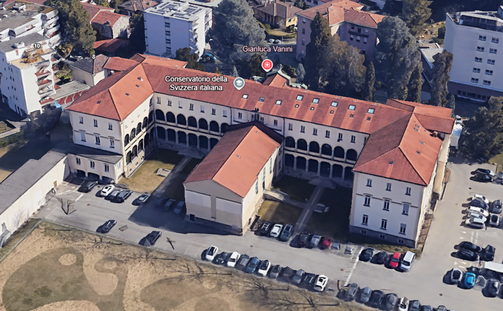
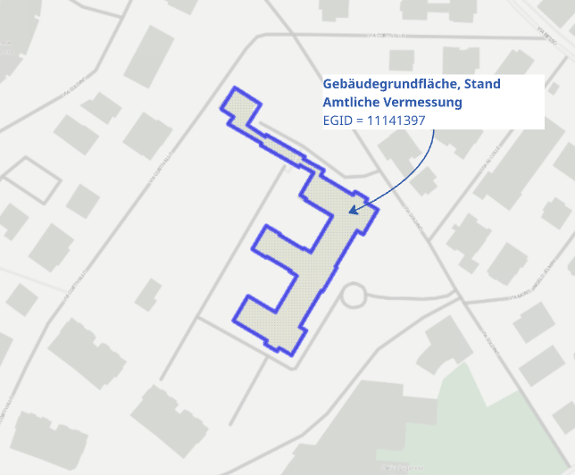

# OpenBuildings.ch

**Swiss building data. Open in theory. Now open in practice.**

[](LICENSE)
[](https://www.python.org/)

---

## The Challenge

Buildings account for **40% of Switzerland's CO₂ emissions**. Every path to net zero runs through the building stock.

But you can't decarbonize what you can't measure. Most organizations are guessing—or paying someone to figure out what should already exist.

Small organizations can't afford specialists. Large ones do the work but keep it locked away. Same outcome: no shared foundation.

**We're changing that.**

---

## What This Is

A building data foundation you can see, use, and learn from.

We've done the work most organizations struggle to scope: defined what data matters, found the best open sources, connected them into a coherent whole.

**Curated. Connected. Maintained. Decision-ready.**

<p align="center">
  
  
</p>
<p align="center">
  
</p>

---

## How It Works

The core calculation combines building footprints from Switzerland's official cadastral survey with high-resolution height models:

```
Building Footprint (Amtliche Vermessung)
         ↓
    1×1m Voxel Grid
         ↓
┌────────┴────────┐
│                 │
swissALTI3D    swissSURFACE3D
(terrain)      (surface)
│                 │
└────────┬────────┘
         ↓
   Volume = Σ(surface - terrain) × 1m²
```

**Result:** Accurate building volumes, heights, and footprint areas for any building in Switzerland.

---

## Quick Start

### Prerequisites

```bash
pip install geopandas rasterio numpy pandas shapely fiona
```

### Data Setup

Download the required geodata:

| Data | Source | Description |
|------|--------|-------------|
| Building footprints | [geodienste.ch/services/av](https://www.geodienste.ch/services/av) | Amtliche Vermessung (layer `lcsf`) |
| Terrain model | [swisstopo](https://www.swisstopo.admin.ch/de/hoehenmodell-swissalti3d) | swissALTI3D (0.5m GeoTIFF) |
| Surface model | [swisstopo](https://www.swisstopo.admin.ch/de/hoehenmodell-swisssurface3d-raster) | swissSURFACE3D (0.5m GeoTIFF) |

Organize your files:

```
OpenBuildings.ch/
├── python/
│   └── main.py
├── data/
│   ├── av_2056.gpkg
│   ├── alti3d/
│   │   └── swissALTI3D_*.tif
│   └── surface3d/
│       └── swissSURFACE3D_*.tif
```

### Run

```bash
# Process all buildings
python python/main.py data/av_2056.gpkg data/alti3d data/surface3d

# Test with 10 buildings
python python/main.py data/av_2056.gpkg data/alti3d data/surface3d --limit 10

# Process specific area (Swiss LV95 coordinates)
python python/main.py data/av_2056.gpkg data/alti3d data/surface3d \
    --bbox 2680000 1235000 2681000 1236000
```

---

## Command Line Reference

```bash
python python/main.py <av_gpkg> <alti3d_dir> <surface3d_dir> [options]
```

| Option | Description |
|--------|-------------|
| `-o, --output FILE` | Output CSV path (default: `building_volumes.csv`) |
| `-g, --gpkg FILE` | Export GeoPackage with geometries |
| `-l, --limit N` | Process only N buildings |
| `-b, --bbox X1 Y1 X2 Y2` | Filter by bounding box (LV95) |

### Examples

```bash
# Custom output location
python python/main.py data/av_2056.gpkg data/alti3d data/surface3d \
    -o results/volumes.csv

# Export with geometries
python python/main.py data/av_2056.gpkg data/alti3d data/surface3d \
    -g buildings_with_volumes.gpkg

# Regional analysis
python python/main.py data/av_2056.gpkg data/alti3d data/surface3d \
    --bbox 2680000 1235000 2681000 1236000 \
    -o zurich_region.csv
```

---

## Output Format

### CSV Columns

| Column | Description |
|--------|-------------|
| `EGID` | Swiss building identifier |
| `volume_m3` | Calculated volume in cubic meters |
| `footprint_area_m2` | Building footprint area |
| `mean_height_m` | Average building height |
| `max_height_m` | Maximum building height |
| `base_height_m` | Terrain elevation at base |
| `status` | `success` / `no_voxels` / `no_height_data` |

### GeoPackage Output

When using `-g`, exports original building geometries with all calculated attributes for use in GIS applications.

---

## Alternative: FME Workbench

For users preferring a visual workflow:

1. Open `fme/swissALTI3D Volumen.fmw` in FME Desktop (2020+)
2. Configure data readers to your geodata paths
3. Run the workbench

---

## Technical Details

### Coordinate System

Swiss LV95 (EPSG:2056). Tile naming follows the pattern `XXXX_YYYY` based on the southwest corner in kilometers.

### Methodology

1. **Voxel Grid**: 1×1m points within each building polygon
2. **Base Height**: Minimum terrain elevation from swissALTI3D
3. **Roof Height**: Surface elevation from swissSURFACE3D at each voxel
4. **Volume**: Sum of (surface − base) × 1m² for all voxels

### Performance

- **Speed**: ~10-20 buildings/second
- **Memory**: Minimal (processes individually)
- **Multi-tile**: Buildings spanning tiles are handled correctly

### Limitations

- Accuracy depends on 0.5m height model resolution
- Underground portions (negative heights) are clamped to 0
- Missing height data results in `status: no_height_data`

---

## Project Structure

```
OpenBuildings.ch/
├── python/main.py              # Core Python implementation
├── fme/swissALTI3D Volumen.fmw # FME visual workflow
├── index.html                  # Web interface (Mapbox + Supabase)
├── documentation/
│   ├── VISION.md               # Project philosophy
│   ├── DATAMODEL.md            # Database schema
│   └── STYLEGUIDE.md           # Design system
├── docs/
│   └── python-usage-examples.txt
└── images/                     # Visualizations
```

---

## Vision & Roadmap

**Start where we are**: Switzerland. The basics are there. Now we add insights.

**Topics follow demand**: Carbon, market data, location analysis. We stay focused until we know what's actually useful.

**The problem isn't Swiss**: We'll expand when the foundation is solid.

Read the full vision: [documentation/VISION.md](documentation/VISION.md)

---

## Business Model

| Tier | What You Get |
|------|--------------|
| **Free** | Explore, search, download individual buildings. The foundation is open. |
| **Paid** | Bulk data, API access, portfolio reports. For organizations that need more. |

Revenue keeps the foundation maintained. The core stays open.

---

## Principles

- **Open by default** — Methods, sources, limitations: all public
- **Quality over quantity** — Good data beats more data
- **Interoperable and stable** — National and international standards; the architecture outlives the tools

---

## Data Sources

| Source | Provider | Updates |
|--------|----------|---------|
| Building footprints | [geodienste.ch](https://www.geodienste.ch) | Varies by canton |
| Height models | [swisstopo](https://www.swisstopo.admin.ch) | Annual |
| Building register (GWR) | [BFS](https://www.bfs.admin.ch) | Daily |
| Coordinate reference | Swiss LV95 (EPSG:2056) | — |

---

## Contributing

This is an open project. Use it. Tell us what's broken. Help make it better.

1. Fork the repository
2. Create your feature branch (`git checkout -b feature/improvement`)
3. Commit your changes (`git commit -m 'Add improvement'`)
4. Push to the branch (`git push origin feature/improvement`)
5. Open a Pull Request

---

## License

[MIT License](LICENSE) — Use freely, contribute back.

---

## Acknowledgments

- **Federal Office of Topography swisstopo** for swissALTI3D and swissSURFACE3D
- **Swiss cadastral authorities** for Amtliche Vermessung data
- **Federal Statistical Office (BFS)** for GWR building register

---

<p align="center">
  <em>Building data belongs to everyone. We're making that real.</em>
</p>
