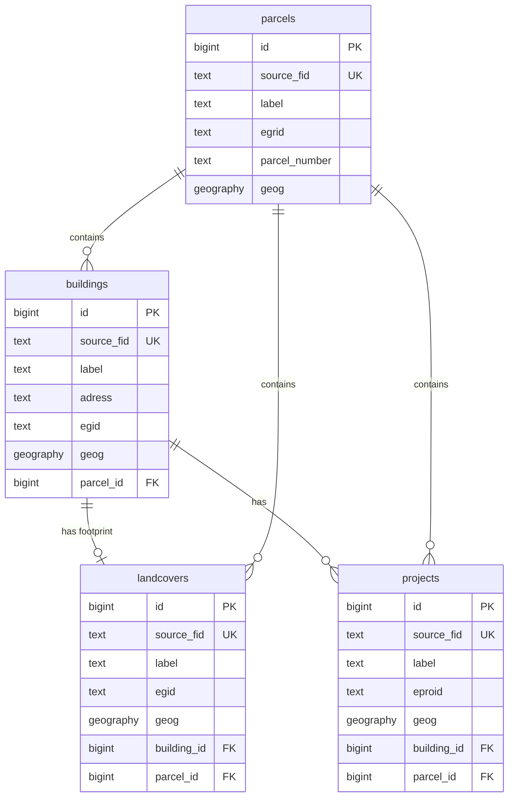

# Swiss Geodata Platform - Database Schema Design

## Project Overview

**Repository**: [swissALTI3D-Volumen](https://github.com/davras5/swissALTI3D-Volumen)
**Database**: PostGIS on Supabase
**Purpose**: Public-facing platform aggregating Swiss OGD (Open Government Data) for buildings, parcels, landcovers, and projects.
**Validation Sources**: GWR Merkmalskatalog 4.2, KKVA Richtlinie Detaillierungsgrad BB, DM.01-AV-CH

---

## Entity Relationship Overview

| Entity | Primary Key | Unique Key | Geometry | Description |
|--------|-------------|------------|----------|-------------|
| `buildings` | `id` | `source_fid` | Point | Individual buildings linked to parcels, with attributes from GWR and volumes from elevation models |
| `parcels` | `id` | `source_fid` | Polygon | Land parcels from cadastral survey |
| `landcovers` | `id` | `source_fid` | Polygon | Landcover polygons including building footprints |
| `projects` | `id` | `source_fid` | Polygon | Construction projects linked to buildings and parcels |

> **Note on identifiers:** We use `source_fid` (feature ID from source system) as the unique key for upserts and data synchronization. The Swiss identifiers (`egid`, `egrid`, `eproid`) are often missing or not unique in source data, so they cannot be relied upon as unique keys.



---

## Column Category Concept

|Icon|Group Name (EN)|Group Name (DE)|Content Strategy|
|:----|:----|:----|:----|
|ℹ️|1. General|Allgemein|The "What" and "When". Identity, type, status, and timeline.|
|📍|2. Location|Standort|The "Where". Address, municipality, and administrative hierarchy.|
|📐|3. Dimensions|Dimensionen|The "How Big". All physical metrics (Area, Volume, Height, Floors).|
|⚡|4. Features|Eigenschaften|The "Details". Technical equipment, legal constraints, zoning, heritage.|
|⚙️|5. System|System|Metadata, internal IDs, and raw source references.|

## Core Tables

### 1. buildings

Primary entity representing individual buildings.

#### 1. General / Allgemein

| Column | Alias (EN) | Alias (DE) | Type | Constraints | Source | Description |
|--------|------------|------------|------|-------------|--------|-------------|
| `label` | Label | Bezeichnung | `text` | | Derived | Display label for frontend |
| `egid` | Building ID | Gebäudeidentifikator | `text` | `CHECK (egid ~ '^[0-9]{1,9}$')` | GWR | Eidgenössischer Gebäudeidentifikator (EGID). Often missing in source data. |
| `status` | Status | Status | `building_status` | | GWR | Building status (GSTAT) |
| `category` | Category | Kategorie | `building_category` | | GWR | Building category (GKAT) |
| `class` | Class | Klasse | `text` | `CHECK (class ~ '^[0-9]{4}$')` | GWR | Building class code (GKLAS) |
| `roof_form` | Roof Form | Dachform | `roof_form` | | Derived | Roof form |
| `construction_year` | Construction Year | Baujahr | `integer` | `CHECK (construction_year BETWEEN 1000 AND 2100)` | GWR | Year of construction (GBAUJ) |
| `construction_period` | Construction Period | Bauperiode | `text` | | GWR | Period of construction (GBAUP). For buildings up to 1980, follows 2000 Census guidelines. For 1981-2015, expressed in 5-year intervals. Since 2016, deduced from construction year. |
| `renovation_year` | Renovation Year | Renovationsjahr | `integer` | `CHECK (renovation_year BETWEEN 1000 AND 2100)` | GWR | Year of last renovation |

#### 2. Location / Standort

| Column | Alias (EN) | Alias (DE) | Type | Constraints | Source | Description |
|--------|------------|------------|------|-------------|--------|-------------|
| `street` | Street | Strasse | `text` | | GWR | Street name |
| `street_nr` | Street Number | Hausnummer | `text` | | GWR | Street number |
| `postal_code` | Postal Code | Postleitzahl | `text` | `CHECK (postal_code ~ '^[0-9]{4}$')` | GWR | Postal code (4 digits in CH) |
| `city` | City | Ort | `text` | | GWR | City/locality |
| `municipality_name` | Municipality Name | Gemeindename | `text` | | GWR | Municipality name |
| `municipality_nr` | Municipality Number | Gemeindenummer | `text` | `CHECK (municipality_nr BETWEEN 1 AND 6999)` | GWR | BFS municipality number (GGDENR) |
| `country` | Country | Land | `text` | `CHECK (country ~ '^[A-Z]{2}$')` | GWR | Country code (ISO 3166-1 alpha-2) |
| `region` | Region | Region | `text` | `CHECK (region ~ '^[A-Z]{2}$')` | GWR | Region code (canton in CH) |
| `parcel_id` | Parcel | Grundstück | `bigint` | `REFERENCES parcels(id)` | Derived | Containing parcel |

#### 3. Dimensions / Dimensionen

| Column | Alias (EN) | Alias (DE) | Type | Constraints | Source | Description |
|--------|------------|------------|------|-------------|--------|-------------|
| `floors_total` | Total Floors | Geschosse Total | `integer` | `CHECK (floors_total BETWEEN 1 AND 200)` | GWR | Anzahl Geschosse total (GASTW, SIA 416) |
| `floors_above` | Floors Above Ground | Oberirdische Geschosse | `integer` | `CHECK (floors_above >= 0)` | GWR | Geschosse oberirdisch (SIA 416) |
| `floors_below` | Floors Below Ground | Unterirdische Geschosse | `integer` | `CHECK (floors_below >= 0)` | GWR | Geschosse unterirdisch (SIA 416) |
| `floors_accuracy` | Floors Accuracy | Geschoss-Genauigkeit | `text` | | Derived | Accuracy and source of floor data |
| `area_footprint_m2` | Footprint Area | Gebäudegrundfläche | `numeric` | `CHECK (area_footprint_m2 >= 0)` | AV | Gebäudegrundfläche GGF (SIA 416) |
| `area_floor_total_m2` | Total Floor Area | Geschossfläche Total | `numeric` | `CHECK (area_floor_total_m2 >= 0)` | Derived | Geschossfläche GF total (SIA 416) |
| `area_floor_above_ground_m2` | Above Ground Floor Area | Oberirdische Geschossfläche | `numeric` | `CHECK (area_floor_above_ground_m2 >= 0)` | Derived | GF oberirdisch (SIA 416) |
| `area_floor_below_ground_m2` | Below Ground Floor Area | Unterirdische Geschossfläche | `numeric` | `CHECK (area_floor_below_ground_m2 >= 0)` | Derived | GF unterirdisch (SIA 416) |
| `area_floor_net_m2` | Net Floor Area | Nettogeschossfläche | `numeric` | `CHECK (area_floor_net_m2 >= 0)` | Derived | Nettogeschossfläche NGF (SIA 416) |
| `area_ebf_m2` | Energy Reference Area | Energiebezugsfläche | `numeric` | `CHECK (area_ebf_m2 >= 0)` | Derived | Energiebezugsfläche EBF (SIA 380) |
| `area_roof_m2` | Roof Area | Dachfläche | `numeric` | `CHECK (area_roof_m2 >= 0)` | Derived | Fläche Dach DAF (eBKP-H) |
| `area_wall_m2` | Wall Area | Aussenwandfläche | `numeric` | `CHECK (area_wall_m2 >= 0)` | Derived | Fläche Aussenwand AWF (eBKP-H) |
| `area_accuracy` | Area Accuracy | Flächen-Genauigkeit | `text` | | Derived | Accuracy and source of area data |
| `volume_total_m3` | Total Volume | Gesamtvolumen | `numeric` | `CHECK (volume_total_m3 >= 0)` | Derived | Gebäudevolumen GV total (SIA 416) |
| `volume_above_ground_m3` | Above Ground Volume | Oberirdisches Volumen | `numeric` | `CHECK (volume_above_ground_m3 >= 0)` | Derived | GV oberirdisch (SIA 416) |
| `volume_below_ground_m3` | Below Ground Volume | Unterirdisches Volumen | `numeric` | `CHECK (volume_below_ground_m3 >= 0)` | Derived | GV unterirdisch (SIA 416) |
| `volume_accuracy` | Volume Accuracy | Volumen-Genauigkeit | `text` | | Derived | Accuracy and source of volume data |
| `elevation_base_m` | Base Elevation | Terrainhöhe | `numeric` | | swissALTI3D | Terrain elevation at base (m.a.s.l.) |
| `height_mean_m` | Mean Height | Mittlere Höhe | `numeric` | `CHECK (height_mean_m >= 0)` | Derived | Mean building height |
| `height_max_m` | Max Height | Maximale Höhe | `numeric` | `CHECK (height_max_m >= 0)` | Derived | Maximum building height |

#### 4. Features / Eigenschaften

| Column | Alias (EN) | Alias (DE) | Type | Constraints | Source | Description |
|--------|------------|------------|------|-------------|--------|-------------|
| `dwellings_count` | Dwellings | Wohnungen | `integer` | `CHECK (dwellings_count >= 0)` | GWR | Number of dwellings |
| `heating_type` | Heating Type | Wärmeerzeuger Heizung | `text` | | GWR | Heating system type (GWAERZH) |
| `heating_source` | Heating Source | Energiequelle Heizung | `text` | | GWR | Heating energy source (GENH) |
| `water_heating_type` | Water Heating Type | Wärmeerzeuger Warmwasser | `text` | | GWR | Hot water system type (GWAERZW) |
| `water_heating_source` | Water Heating Source | Energiequelle Warmwasser | `text` | | GWR | Hot water energy source (GENW) |
| `heritage_category` | Heritage Category | Schutzkategorie | `heritage_category` | | KGS | Protection category (A/B) |
| `heritage_inventory_nr` | Heritage Inventory Nr | KGS-Inventarnummer | `integer` | | KGS | Inventory number |
| `zone_main` | Main Zone | Hauptnutzungszone | `text` | | ARE | Main zoning classification |
| `zone_type` | Zone Type | Zonentyp | `text` | | ARE | Specific zone type |

#### 5. System / System

| Column | Alias (EN) | Alias (DE) | Type | Constraints | Source | Description |
|--------|------------|------------|------|-------------|--------|-------------|
| `id` | ID | ID | `bigint` | `PRIMARY KEY, GENERATED ALWAYS AS IDENTITY` | System | System ID |
| `source_fid` | Source Feature ID | Quell-Feature-ID | `text` | `UNIQUE, NOT NULL` | Various | Feature ID from source system. Used for upserts and data synchronization. |
| `created_at` | Created | Erstellt | `timestamptz` | `NOT NULL DEFAULT NOW()` | System | Record creation timestamp |
| `updated_at` | Updated | Aktualisiert | `timestamptz` | `NOT NULL DEFAULT NOW()` | System | Record last update timestamp |
| `geog` | Location | Standort | `geography(POINT, 4326)` | `NOT NULL` | GWR | Building centroid

---

### 2. parcels

Land parcels from cadastral survey.

#### 1. General / Allgemein

| Column | Alias (EN) | Alias (DE) | Type | Constraints | Source | Description |
|--------|------------|------------|------|-------------|--------|-------------|
| `label` | Label | Bezeichnung | `text` | | Derived | Display label for frontend |
| `egrid` | Parcel ID | Grundstückidentifikator | `text` | `CHECK (egrid ~ '^CH[0-9]{12}$')` | AV | E-GRID identifier. Often missing in source data. |
| `status` | Status | Status | `parcel_status` | | AV | Parcel status |
| `type` | Type | Typ | `parcel_type` | | AV | Parcel type (LTYP) |
| `parcel_number` | Parcel Number | Parzellennummer | `text` | | AV | Local parcel number (Grundstücksnummer) |

#### 2. Location / Standort

| Column | Alias (EN) | Alias (DE) | Type | Constraints | Source | Description |
|--------|------------|------------|------|-------------|--------|-------------|
| `municipality_name` | Municipality Name | Gemeindename | `text` | | AV | Municipality name |
| `municipality_nr` | Municipality Number | Gemeindenummer | `text` | `CHECK (municipality_nr BETWEEN 1 AND 6999)` | AV | BFS municipality number |

#### 3. Dimensions / Dimensionen

> **Note on area calculations:** Swiss cadastral surveys use **horizontal projection** (Horizontalprojektion) for all area measurements. This means the official `area_m2` represents the 2D planimetric area, not the actual 3D surface area. On sloped terrain, the true surface area can be significantly larger (e.g., +41% at 45° slope). The legally binding value from AV is always the projected area.

| Column | Alias (EN) | Alias (DE) | Type | Constraints | Source | Description |
|--------|------------|------------|------|-------------|--------|-------------|
| `area_m2` | Area (Official) | Fläche (Offiziell) | `numeric` | `CHECK (area_m2 >= 0)` | AV | Parcel area GSF in m² (Grundstücksfläche). Legally binding (rechtskräftig) horizontal projection from cadastral survey. |
| `area_surface_m2` | Surface Area | Oberflächenfläche | `numeric` | `CHECK (area_surface_m2 >= 0)` | Derived | 3D surface area in m², accounting for terrain slope (calculated from polygon draped on swissALTI3D DTM) |
| `area_ggf_m2` | Building Footprint Area | Gebäudegrundfläche | `numeric` | `CHECK (area_ggf_m2 >= 0)` | Derived | Sum of building footprints in m² (GGF). Based on 2D polygon area. |
| `area_uf_m2` | Surrounding Area | Umgebungsfläche | `numeric` | `CHECK (area_uf_m2 >= 0)` | Derived | Surrounding area in m² (UF, SIA 416). Based on 2D polygon area. |
| `area_buf_m2` | Processed Surrounding | Bearbeitete Umgebung | `numeric` | `CHECK (area_buf_m2 >= 0)` | Derived | Processed surrounding area in m² (BUF, SIA 416). Based on 2D polygon area. |
| `area_uuf_m2` | Unprocessed Surrounding | Unbearbeitete Umgebung | `numeric` | `CHECK (area_uuf_m2 >= 0)` | Derived | Unprocessed surrounding area in m² (UUF, SIA 416). Based on 2D polygon area. |
| `sealed_area_m2` | Sealed Area | Versiegelte Fläche | `numeric` | `CHECK (sealed_area_m2 >= 0)` | Derived | Sealed/impervious surface in m². Based on 2D polygon area. |

#### 4. Features / Eigenschaften

| Column | Alias (EN) | Alias (DE) | Type | Constraints | Source | Description |
|--------|------------|------------|------|-------------|--------|-------------|
| `zone_main` | Main Zone | Hauptnutzungszone | `text` | | ARE | Main zoning classification |
| `zone_type` | Zone Type | Zonentyp | `text` | | ARE | Specific zone type |

#### 5. System / System

| Column | Alias (EN) | Alias (DE) | Type | Constraints | Source | Description |
|--------|------------|------------|------|-------------|--------|-------------|
| `id` | ID | ID | `bigint` | `PRIMARY KEY, GENERATED ALWAYS AS IDENTITY` | System | System ID |
| `source_fid` | Source Feature ID | Quell-Feature-ID | `text` | `UNIQUE, NOT NULL` | AV | Feature ID from source system. Used for upserts and data synchronization. |
| `created_at` | Created | Erstellt | `timestamptz` | `NOT NULL DEFAULT NOW()` | System | Record creation timestamp |
| `updated_at` | Updated | Aktualisiert | `timestamptz` | `NOT NULL DEFAULT NOW()` | System | Record last update timestamp |
| `geog` | Geometry | Geometrie | `geography(POLYGON, 4326)` | `NOT NULL` | AV | Parcel boundary

---

### 3. landcovers

Landcover polygons from cadastral survey. Landcovers can represent building footprints (Type = Building / Gebäude).

#### 1. General / Allgemein

| Column | Alias (EN) | Alias (DE) | Type | Constraints | Source | Description |
|--------|------------|------------|------|-------------|--------|-------------|
| `label` | Label | Bezeichnung | `text` | | Derived | Display label for frontend |
| `egid` | Building ID | Gebäudeidentifikator | `text` | `CHECK (egid ~ '^[0-9]{1,9}$')` | GWR | Eidgenössischer Gebäudeidentifikator (EGID). Often missing in source data. |
| `status` | Status | Status | `text` | | AV | Landcover status |
| `type` | Type | Typ | `landcover_type` | `NOT NULL` | AV | Landcover classification |

#### 2. Location / Standort

| Column | Alias (EN) | Alias (DE) | Type | Constraints | Source | Description |
|--------|------------|------------|------|-------------|--------|-------------|
| `parcel_id` | Parcel | Grundstück | `bigint` | `REFERENCES parcels(id)` | Derived | Containing parcel |
| `building_id` | Building | Gebäude | `bigint` | `REFERENCES buildings(id)` | Derived | Link to building (for footprints) |

#### 3. Dimensions / Dimensionen

| Column | Alias (EN) | Alias (DE) | Type | Constraints | Source | Description |
|--------|------------|------------|------|-------------|--------|-------------|
| `area_m2` | Polygon Area | Polygonfläche | `numeric` | `CHECK (area_m2 >= 0)` | Derived | 2D projected area calculated from polygon geometry (for validation against official area) |
| `volume_total_m3` | Volume | Volumen | `numeric` | `CHECK (volume_total_m3 >= 0)` | Derived | Building volume in m³ (for type=building) |
| `elevation_base_m` | Base Elevation | Terrainhöhe | `numeric` | | swissALTI3D | Terrain elevation at base (m.a.s.l.) |
| `height_mean_m` | Mean Height | Mittlere Höhe | `numeric` | `CHECK (height_mean_m >= 0)` | Derived | Mean height in m (for type=building) |
| `height_max_m` | Max Height | Maximale Höhe | `numeric` | `CHECK (height_max_m >= 0)` | Derived | Maximum height in m (for type=building) |

#### 4. Features / Eigenschaften

*(Reserved for future material/usage properties)*

#### 5. System / System

| Column | Alias (EN) | Alias (DE) | Type | Constraints | Source | Description |
|--------|------------|------------|------|-------------|--------|-------------|
| `id` | ID | ID | `bigint` | `PRIMARY KEY, GENERATED ALWAYS AS IDENTITY` | System | System ID |
| `source_fid` | Source Feature ID | Quell-Feature-ID | `text` | `UNIQUE, NOT NULL` | AV | Feature ID from source system. Used for upserts and data synchronization. |
| `created_at` | Created | Erstellt | `timestamptz` | `NOT NULL DEFAULT NOW()` | System | Record creation timestamp |
| `updated_at` | Updated | Aktualisiert | `timestamptz` | `NOT NULL DEFAULT NOW()` | System | Record last update timestamp |
| `geog` | Geometry | Geometrie | `geography(POLYGON, 4326)` | `NOT NULL` | AV | Landcover polygon

---

### 4. projects

Construction projects from GWR.

#### 1. General / Allgemein

| Column | Alias (EN) | Alias (DE) | Type | Constraints | Source | Description |
|--------|------------|------------|------|-------------|--------|-------------|
| `label` | Label | Bezeichnung | `text` | | Derived | Display label for frontend |
| `eproid` | Project ID | Bauprojektidentifikator | `text` | `CHECK (eproid ~ '^[0-9]{1,15}$')` | GWR | EPROID identifier. Often missing in source data. |
| `status` | Status | Status | `project_status` | | GWR | Project status (PSTAT) |
| `project_type` | Project Type | Projektart | `project_type` | | GWR | Type of construction (PARTBW) |
| `building_type` | Building Type | Bauwerkstyp | `text` | | GWR | Specific building type (PTYPBW) |
| `date_submitted` | Submitted | Beantragt | `date` | | GWR | Permit application date (PDATIN) |
| `date_approved` | Approved | Bewilligt | `date` | | GWR | Permit approval date (PDATOK) |
| `date_started` | Started | Baubeginn | `date` | | GWR | Construction start date (PDATBB) |
| `date_completed` | Completed | Abgeschlossen | `date` | | GWR | Completion date (PDATBE) |

#### 2. Location / Standort

| Column | Alias (EN) | Alias (DE) | Type | Constraints | Source | Description |
|--------|------------|------------|------|-------------|--------|-------------|
| `municipality_nr` | Municipality Number | Gemeindenummer | `text` | `CHECK (municipality_nr BETWEEN 1 AND 6999)` | GWR | BFS municipality number |
| `parcel_id` | Parcel | Grundstück | `bigint` | `REFERENCES parcels(id)` | Derived | Associated parcel |
| `building_id` | Building | Gebäude | `bigint` | `REFERENCES buildings(id)` | GWR | Associated building (EGID) |

#### 3. Dimensions / Dimensionen

*(Use computed geometry area)*

#### 4. Features / Eigenschaften

*(Reserved for future permit constraints)*

#### 5. System / System

| Column | Alias (EN) | Alias (DE) | Type | Constraints | Source | Description |
|--------|------------|------------|------|-------------|--------|-------------|
| `id` | ID | ID | `bigint` | `PRIMARY KEY, GENERATED ALWAYS AS IDENTITY` | System | System ID |
| `source_fid` | Source Feature ID | Quell-Feature-ID | `text` | `UNIQUE, NOT NULL` | GWR | Feature ID from source system. Used for upserts and data synchronization. |
| `created_at` | Created | Erstellt | `timestamptz` | `NOT NULL DEFAULT NOW()` | System | Record creation timestamp |
| `updated_at` | Updated | Aktualisiert | `timestamptz` | `NOT NULL DEFAULT NOW()` | System | Record last update timestamp |
| `geog` | Geometry | Geometrie | `geography(POLYGON, 4326)` | | GWR | Project perimeter

---

## Enumerations

### buildings.status (GSTAT) — GWR

From GWR Merkmalskatalog 4.2, Gebäudestatus.

| Code | Value | Alias (DE) | Alias (EN) |
|------|-------|------------|------------|
| 1001 | `planned` | projektiert | Planned |
| 1002 | `approved` | bewilligt | Approved |
| 1003 | `under_construction` | im Bau | Under construction |
| 1004 | `existing` | bestehend | Existing |
| 1005 | `unusable` | nicht nutzbar | Unusable |
| 1007 | `demolished` | abgebrochen | Demolished |
| 1008 | `not_realized` | nicht realisiert | Not realized |

```sql
CREATE TYPE building_status AS ENUM (
    'planned',           -- 1001
    'approved',          -- 1002
    'under_construction', -- 1003
    'existing',          -- 1004
    'unusable',          -- 1005
    'demolished',        -- 1007
    'not_realized'       -- 1008
);
```

---

### buildings.category (GKAT) — GWR

From GWR Merkmalskatalog 4.2, Gebäudekategorie.

| Code | Value | Alias (DE) | Alias (EN) |
|------|-------|------------|------------|
| 1010 | `provisional` | Provisorische Unterkunft | Provisional dwelling |
| 1020 | `single_family` | Einfamilienhaus | Single-family house |
| 1025 | `row_house` | Reiheneinfamilienhaus | Row house |
| 1030 | `multi_family` | Mehrfamilienhaus | Multi-family house |
| 1040 | `residential_mixed` | Wohngebäude mit Nebennutzung | Residential building with secondary use |
| 1060 | `residential_commercial` | Gebäude mit teilweiser Wohnnutzung | Building with partial residential use |
| 1080 | `commercial_only` | Gebäude ohne Wohnnutzung | Building without residential use |

```sql
CREATE TYPE building_category AS ENUM (
    'provisional',          -- 1010
    'single_family',        -- 1020
    'row_house',            -- 1025
    'multi_family',         -- 1030
    'residential_mixed',    -- 1040
    'residential_commercial', -- 1060
    'commercial_only'       -- 1080
);
```

---

### buildings.roof_form — Derived

Inferred from elevation models.

| Value | Alias (DE) | Alias (EN) |
|-------|------------|------------|
| `flat` | Flachdach | Flat roof |
| `gable` | Satteldach | Gable roof |
| `hip` | Walmdach | Hip roof |
| `mansard` | Mansarddach | Mansard roof |
| `pyramid` | Pyramidendach | Pyramid roof |
| `dome` | Kuppeldach | Dome roof |
| `shed` | Pultdach | Shed roof |
| `other` | Andere | Other |

```sql
CREATE TYPE roof_form AS ENUM (
    'flat',
    'gable',
    'hip',
    'mansard',
    'pyramid',
    'dome',
    'shed',
    'other'
);
```

---

### buildings.construction_period (GBAUP) — GWR

From GWR Merkmalskatalog 4.2, Bauperiode.

For buildings constructed up to and including 1980, the subdivision into construction periods follows the guidelines for the Buildings and Dwellings Statistics used in the 2000 Federal Population Census. For buildings constructed from 1981 (and up to 2015 at the latest), the construction period is expressed in five-year intervals. Since 2016, the construction period is deduced based on the year of construction.

| Code | Value | Alias (DE) | Alias (EN) |
|------|-------|------------|------------|
| 8011 | `before_1919` | vor 1919 | Period before 1919 |
| 8012 | `1919_1945` | 1919 bis 1945 | Period from 1919 to 1945 |
| 8013 | `1946_1960` | 1946 bis 1960 | Period from 1946 to 1960 |
| 8014 | `1961_1970` | 1961 bis 1970 | Period from 1961 to 1970 |
| 8015 | `1971_1980` | 1971 bis 1980 | Period from 1971 to 1980 |
| 8016 | `1981_1985` | 1981 bis 1985 | Period from 1981 to 1985 |
| 8017 | `1986_1990` | 1986 bis 1990 | Period from 1986 to 1990 |
| 8018 | `1991_1995` | 1991 bis 1995 | Period from 1991 to 1995 |
| 8019 | `1996_2000` | 1996 bis 2000 | Period from 1996 to 2000 |
| 8020 | `2001_2005` | 2001 bis 2005 | Period from 2001 to 2005 |
| 8021 | `2006_2010` | 2006 bis 2010 | Period from 2006 to 2010 |
| 8022 | `2011_2015` | 2011 bis 2015 | Period from 2011 to 2015 |
| 8023 | `2016_onwards` | ab 2016 | Period from 2016 onwards |

```sql
CREATE TYPE construction_period AS ENUM (
    'before_1919',   -- 8011
    '1919_1945',     -- 8012
    '1946_1960',     -- 8013
    '1961_1970',     -- 8014
    '1971_1980',     -- 8015
    '1981_1985',     -- 8016
    '1986_1990',     -- 8017
    '1991_1995',     -- 8018
    '1996_2000',     -- 8019
    '2001_2005',     -- 8020
    '2006_2010',     -- 8021
    '2011_2015',     -- 8022
    '2016_onwards'   -- 8023
);
```

---

### buildings.heritage_category — KGS

From KGS Inventar (Kulturgüterschutz).

| Value | Alias (DE) | Alias (EN) | Description |
|-------|------------|------------|-------------|
| `a` | Kategorie A | Category A | Objects of national importance |
| `b` | Kategorie B | Category B | Objects of regional importance |

```sql
CREATE TYPE heritage_category AS ENUM ('a', 'b');
```

---

### landcovers.type — AV

From DM.01-AV-CH, Bodenbedeckungsarten. 25 official types.

| Code | Value | Category (DE) | Alias (DE) | Alias (EN) |
|------|-------|---------------|------------|------------|
| 0 | `building` | Befestigte Flächen | Gebäude | Building |
| 1 | `hardened_area` | Befestigte Flächen | Befestigte Fläche | Hardened area |
| 2 | `greenhouse` | Befestigte Flächen | Gewächshaus | Greenhouse |
| 3 | `perennial_culture_shelter` | Befestigte Flächen | Unterstand Dauerkultur | Perennial culture shelter |
| 4 | `reservoir` | Befestigte Flächen | Wasserbecken | Reservoir |
| 5 | `other_hardened` | Befestigte Flächen | Übrige befestigte | Other hardened |
| 6 | `railway` | Verkehrsflächen | Bahn | Railway |
| 7 | `road_path` | Verkehrsflächen | Strasse/Weg | Road/Path |
| 8 | `field_meadow_pasture` | Landwirtschaft | Acker/Wiese/Weide | Field/Meadow/Pasture |
| 9 | `vineyard` | Landwirtschaft | Reben | Vineyard |
| 10 | `other_intensive_culture` | Landwirtschaft | Übrige Intensivkultur | Other intensive culture |
| 11 | `garden` | Landwirtschaft | Garten | Garden |
| 12 | `moor` | Humusierte Flächen | Moor | Moor |
| 13 | `other_humusised` | Humusierte Flächen | Übrige humusierte | Other humusised |
| 14 | `standing_water` | Gewässer | Stehendes Gewässer | Standing water |
| 15 | `flowing_water` | Gewässer | Fliessendes Gewässer | Flowing water |
| 16 | `reed_belt` | Gewässer | Schilfgürtel | Reed belt |
| 17 | `closed_forest` | Bestockte Flächen | Geschlossener Wald | Closed forest |
| 18 | `dense_wooded_pasture` | Bestockte Flächen | Übrige dicht bestockte | Dense wooded pasture |
| 19 | `open_wooded_pasture` | Bestockte Flächen | Übrige locker bestockte | Open wooded pasture |
| 20 | `other_wooded` | Bestockte Flächen | Gehölz | Other wooded |
| 21 | `rock` | Vegetationslose Flächen | Fels | Rock |
| 22 | `glacier_firn` | Vegetationslose Flächen | Gletscher/Firn | Glacier/Firn |
| 23 | `gravel_sand` | Vegetationslose Flächen | Kies/Sand | Gravel/Sand |
| 24 | `quarry_dump` | Vegetationslose Flächen | Abbau/Deponie | Quarry/Dump |
| 25 | `other_unvegetated` | Vegetationslose Flächen | Übrige vegetationslose | Other unvegetated |

```sql
CREATE TYPE landcover_type AS ENUM (
    'building',              -- 0
    'hardened_area',         -- 1
    'greenhouse',            -- 2
    'perennial_culture_shelter', -- 3
    'reservoir',             -- 4
    'other_hardened',        -- 5
    'railway',               -- 6
    'road_path',             -- 7
    'field_meadow_pasture',  -- 8
    'vineyard',              -- 9
    'other_intensive_culture', -- 10
    'garden',                -- 11
    'moor',                  -- 12
    'other_humusised',       -- 13
    'standing_water',        -- 14
    'flowing_water',         -- 15
    'reed_belt',             -- 16
    'closed_forest',         -- 17
    'dense_wooded_pasture',  -- 18
    'open_wooded_pasture',   -- 19
    'other_wooded',          -- 20
    'rock',                  -- 21
    'glacier_firn',          -- 22
    'gravel_sand',           -- 23
    'quarry_dump',           -- 24
    'other_unvegetated'      -- 25
);
```

---

### parcels.status — AV

From DM.01-AV-CH Liegenschaft model.

| Value | Alias (DE) | Alias (EN) |
|-------|------------|------------|
| `legally_valid` | Rechtskräftig | Legally valid |
| `in_progress` | In Bearbeitung | In progress |
| `projected` | Projektiert | Projected |

```sql
CREATE TYPE parcel_status AS ENUM (
    'legally_valid',
    'in_progress',
    'projected'
);
```

---

### parcels.type (LTYP) — AV/GWR

From GWR Merkmalskatalog, LTYP enumeration.

| Code | Value | Alias (DE) | Alias (EN) |
|------|-------|------------|------------|
| 1 | `property` | Liegenschaft | Property (land parcel) |
| 2 | `sdp_on_parcel` | Selbständiges und dauerndes Recht auf Grundstück | Independent and permanent right on a parcel |
| 3 | `mining_right` | Bergwerk | Mining concession |

```sql
CREATE TYPE parcel_type AS ENUM (
    'property',        -- 1
    'sdp_on_parcel',   -- 2
    'mining_right'     -- 3
);
```

---

### projects.status (PSTAT) — GWR

From GWR Merkmalskatalog 4.2, Bauprojektstatus.

| Code | Value | Alias (DE) | Alias (EN) | Trigger |
|------|-------|------------|------------|---------|
| 6701 | `submitted` | Baugesuch eingereicht | Building permit submitted | PDATIN set |
| 6702 | `approved` | Baubewilligung erteilt | Building permit granted | PDATOK set |
| 6703 | `under_construction` | Projekt baubegonnen | Construction started | PDATBB set |
| 6704 | `completed` | Projekt abgeschlossen | Project completed | PDATBE set |
| 6706 | `suspended` | Projekt sistiert | Project suspended | PDATSIST set |
| 6707 | `rejected` | Baugesuch abgelehnt | Permit rejected | PDATABL set |
| 6708 | `not_realized` | Projekt nicht realisiert | Not realized (permit expired) | PDATANN set |
| 6709 | `withdrawn` | Projekt zurückgezogen | Permit withdrawn by applicant | PDATRZG set |

```sql
CREATE TYPE project_status AS ENUM (
    'submitted',          -- 6701
    'approved',           -- 6702
    'under_construction', -- 6703
    'completed',          -- 6704
    'suspended',          -- 6706
    'rejected',           -- 6707
    'not_realized',       -- 6708
    'withdrawn'           -- 6709
);
```

---

### projects.project_type (PARTBW) — GWR

Art der Bauwerke from GWR.

| Code | Value | Alias (DE) | Alias (EN) |
|------|-------|------------|------------|
| 6010 | `civil_engineering` | Tiefbau | Civil engineering |
| 6011 | `building` | Hochbau | Building construction |
| 6012 | `special_structure` | Sonderbau | Special structure |

```sql
CREATE TYPE project_type AS ENUM (
    'civil_engineering',  -- 6010
    'building',           -- 6011
    'special_structure'   -- 6012
);
```

---

### projects.building_type (PTYPBW) — GWR

Typ der Bauwerke. 48 official types in 11 groups.

#### Infrastructure: Supply (621x)

| Code | Alias (DE) | Alias (EN) |
|------|------------|------------|
| 6211 | Wasserversorgungsanlagen | Water supply facilities |
| 6212 | Elektrizitätswerke und -netze | Electricity works and networks |
| 6213 | Gaswerke und -netze | Gas works and networks |
| 6214 | Fernheizungsanlagen | District heating facilities |
| 6219 | Übrige Versorgungsanlagen | Other supply facilities |

#### Infrastructure: Disposal (622x)

| Code | Alias (DE) | Alias (EN) |
|------|------------|------------|
| 6221 | Wasserentsorgungsanlagen | Water disposal facilities |
| 6222 | Kehrichtentsorgungsanlagen | Waste disposal facilities |
| 6223 | Übrige Entsorgungsanlagen | Other disposal facilities |

#### Residential (627x)

| Code | Alias (DE) | Alias (EN) |
|------|------------|------------|
| 6271 | Einfamilienhäuser freistehend | Single-family houses, detached |
| 6272 | Einfamilienhäuser angebaut | Single-family houses, attached |
| 6273 | Mehrfamilienhäuser | Multi-family houses |
| 6274 | Wohngebäude mit Nebennutzung | Residential with secondary use |
| 6276 | Wohnheime ohne Pflegedienste | Residential homes (without care) |
| 6278 | Garagen, Parkplätze, Einstellhallen (bei Wohngebäuden) | Garages, parking, covered parking (with residential) |
| 6279 | Übrige Bauten (bei Wohngebäuden) | Other structures (with residential) |

**Reference**: [GWR Merkmalskatalog 4.2](https://www.housing-stat.ch/files/881-2200.pdf) for complete PTYPBW enumeration.

---

## Reference Tables

### landcover_types — AV

Lookup table for landcover classifications with multilingual names.

#### System

| Column | Alias (EN) | Alias (DE) | Type | Constraints | Source | Description |
|--------|------------|------------|------|-------------|--------|-------------|
| `code` | Code | Code | `text` | `PRIMARY KEY` | AV | Landcover type code |
| `av_code` | AV Code | AV-Code | `integer` | `UNIQUE NOT NULL` | AV | Numeric code from DM.01-AV-CH |
| `category` | Category | Kategorie | `text` | `NOT NULL` | AV | Landcover category |

#### Names

| Column | Alias (EN) | Alias (DE) | Type | Constraints | Source | Description |
|--------|------------|------------|------|-------------|--------|-------------|
| `name_de` | Name (DE) | Name (DE) | `text` | `NOT NULL` | AV | German name |
| `name_fr` | Name (FR) | Name (FR) | `text` | | AV | French name |
| `name_it` | Name (IT) | Name (IT) | `text` | | AV | Italian name |
| `name_en` | Name (EN) | Name (EN) | `text` | `NOT NULL` | AV | English name |

---

### municipalities — BFS

BFS municipality register.

#### System

| Column | Alias (EN) | Alias (DE) | Type | Constraints | Source | Description |
|--------|------------|------------|------|-------------|--------|-------------|
| `bfs_nr` | BFS Number | BFS-Nummer | `integer` | `PRIMARY KEY, CHECK (bfs_nr BETWEEN 1 AND 6999)` | BFS | BFS municipality number |
| `name` | Name | Name | `text` | `NOT NULL` | BFS | Municipality name |

#### Administrative

| Column | Alias (EN) | Alias (DE) | Type | Constraints | Source | Description |
|--------|------------|------------|------|-------------|--------|-------------|
| `region` | Region | Region | `text` | `CHECK (region ~ '^[A-Z]{2}$')` | BFS | Canton code |
| `district` | District | Bezirk | `text` | | BFS | District name |

---

## Key Documentation

### Primary Standards

| Document | URL | Referenced in Schema |
|----------|-----|---------------------|
| GWR Merkmalskatalog 4.2 | https://www.housing-stat.ch/files/881-2200.pdf | buildings (GSTAT, GKAT, GKLAS, GASTW, GBAUJ, GENH, GWAERZH, etc.), projects (PSTAT, PARTBW, PTYPBW) |
| GWR Public Data | https://www.housing-stat.ch/__publicdata | buildings, projects data access |
| DM.01-AV-CH (Datenmodell AV) | https://www.cadastre-manual.admin.ch/de/datenmodell-der-amtlichen-vermessung-dm01-av-ch | parcels, landcovers (25 Bodenbedeckungsarten), parcel types (LTYP) |
| DMAV (Geodatenmodell AV) | https://www.cadastre-manual.admin.ch/de/geodatenmodell-der-amtlichen-vermessung-dmav | Future replacement for DM.01-AV-CH (deadline: 31.12.2027) |
| KKVA Richtlinie Detaillierungsgrad BB | https://www.cadastre-manual.admin.ch/dam/de/sd-web/J969zG4lGjuV/Richtlinie-Detaillierungsgrad-BB-de.pdf | Validation source for landcover classification |
| Weisung AV-GWR Gebäudeerfassung | https://www.housing-stat.ch/files/1754-2300.pdf | Building-GWR linkage rules |
| Cadastre Manual | https://www.cadastre-manual.admin.ch | AV weisungen, model documentation |

### Swiss Norms (SIA / CRB)

| Document | URL | Referenced in Schema |
|----------|-----|---------------------|
| SIA 416 (Flächen und Volumen) | https://shop.sia.ch/normenwerk/architekt/sia%20416/dfi/D/Product | GGF, GF, NGF, GV, UF, BUF, UUF (buildings.area_*, buildings.volume_*, parcels.area_*) |
| SIA 380/1 (Thermische Energie) | https://shop.sia.ch/normenwerk/architekt/sia%20380-1/d/D/Product | EBF Energiebezugsfläche (buildings.area_ebf_m2) |
| eBKP-H / SN 506 511 | https://www.crb.ch/normen-standards/baukostenplane/baukostenplan-hochbau-ebkp-h | DAF, AWF (buildings.area_roof_m2, buildings.area_wall_m2) |
| eBKP-H Auszug (PDF) | https://www.crb.ch/_Resources/Persistent/5/1/7/d/517de4b60fd6f28b6137e873ea1c9284f345e648/Auszug_eBKP_2020_Web.pdf | Free excerpt of element-based cost plan |

### Federal Geodata Infrastructure

| Document | URL | Referenced in Schema |
|----------|-----|---------------------|
| geo.admin.ch Tech Docs | https://docs.geo.admin.ch | API documentation for all geo.admin.ch services |
| swisstopo Products | https://www.swisstopo.admin.ch/de/geodata | swissALTI3D, swissSURFACE3D, swissBUILDINGS3D, swissBOUNDARIES3D |
| geodienste.ch | https://www.geodienste.ch | Cantonal AV data (WMS, WFS, INTERLIS downloads) |
| opendata.swiss | https://opendata.swiss | Swiss OGD portal (aggregated datasets) |
| BFS Amtliches Gemeindeverzeichnis | https://www.bfs.admin.ch/bfs/de/home/grundlagen/agvch.html | municipalities reference table (BFS-Nr / municipality_nr) |
| INTERLIS | https://interlis.ch | Swiss geodata transfer format |

### API Endpoints

| Service | URL | Description |
|---------|-----|-------------|
| Tech Docs | https://docs.geo.admin.ch | API documentation and guides |
| Layer Catalog | https://api3.geo.admin.ch/rest/services/ech/MapServer | Complete list of available layers |
| Identify | https://api3.geo.admin.ch/rest/services/api/MapServer/identify | Query features by location |
| Find | https://api3.geo.admin.ch/rest/services/api/MapServer/find | Search features by attribute |
| Search | https://api3.geo.admin.ch/rest/services/api/SearchServer | Full-text search (addresses, layers, features) |
| WMS | https://wms.geo.admin.ch | OGC Web Map Service |
| WMTS | https://wmts.geo.admin.ch | OGC Web Map Tile Service |
| STAC | https://data.geo.admin.ch/api/stac/v1 | Spatiotemporal Asset Catalog for downloads |
| Data Browser | https://data.geo.admin.ch/browser | Interactive data download |
| geodienste.ch API | https://www.geodienste.ch/info/services.csv | Service metadata and availability |

### Data Sources

Primary data access is through the **Federal Spatial Data Infrastructure (FSDI)** via geo.admin.ch services.

| Key | Dataset | Provider | Layer ID | Access | Update | Content |
|-----|---------|----------|----------|--------|--------|---------|
| GWR | Gebäude- und Wohnungsregister | BFS | `ch.bfs.gebaeude_wohnungs_register` | OGD | Daily | Building attributes, dwellings, addresses |
| GWR-GENH | GWR Energie-/Wärmequelle Heizung | BFS | `ch.bfs.gebaeude_wohnungs_register_waermequelle_heizung` | OGD | Daily | Heating energy sources |
| AV | Amtliche Vermessung | Cantonal Offices | via geodienste.ch | OGD | Varies | Footprints, parcels, landcovers |
| swissALTI3D | swissALTI3D | swisstopo | `ch.swisstopo.swissalti3d` | OGD | Annual | Terrain elevation model (DTM) |
| swissSURFACE3D | swissSURFACE3D | swisstopo | `ch.swisstopo.swisssurface3d` | OGD | Annual | Surface elevation model (DSM) |
| swissBUILDINGS3D | swissBUILDINGS3D | swisstopo | `ch.swisstopo.swissbuildings3d` | OGD | Annual | 3D building models |
| swissBOUNDARIES3D | swissBOUNDARIES3D | swisstopo | `ch.swisstopo.swissboundaries3d-gemeinde-flaeche.fill` | OGD | Annual | Municipality boundaries |
| ARE | Bauzonen Schweiz | ARE | `ch.are.bauzonen` | OGD | Annual | Zoning classifications |
| KGS | KGS Inventar | BABS | `ch.babs.kulturgueter` | OGD | Occasional | Heritage protection (A/B) |

### Notes

- **SIA norms are commercial**: SIA 416 and SIA 380/1 require purchase from the SIA shop.
- **DM.01-AV-CH transition**: Will be replaced by DMAV by December 31, 2027. Plan for data model migration.
- **geodienste.ch**: Provides cantonal AV data in multiple formats (INTERLIS, GeoPackage, Shapefile, DXF). Registration may be required for some cantons.

---

## Data Licensing & Attribution

### Licensing Overview

All data sources used in OpenBuildings.ch are Open Government Data (OGD) and can be used freely, including for commercial purposes, provided proper attribution is given.

### Federal Data Sources

| Source | Provider | License | Commercial Use | Attribution |
|--------|----------|---------|----------------|-------------|
| swissALTI3D | swisstopo | OGD | ✅ Yes | Required |
| swissSURFACE3D | swisstopo | OGD | ✅ Yes | Required |
| swissBUILDINGS3D | swisstopo | OGD | ✅ Yes | Required |
| swissBOUNDARIES3D | swisstopo | OGD | ✅ Yes | Required |
| GWR (Stufe A) | BFS | OGD | ✅ Yes | Required |
| Bauzonen Schweiz | ARE | OGD | ✅ Yes | Required |
| KGS Inventar | BABS | OGD | ✅ Yes | Required |

### Cantonal AV Data (Amtliche Vermessung)

Source: [geodienste.ch/services/av](https://www.geodienste.ch/services/av) — Status as of 2024

| Canton | Availability | Open Data License | Complete | Notes |
|--------|--------------|-------------------|----------|-------|
| AG | Frei erhältlich | CC BY | Ja | |
| AI | Frei erhältlich | CC BY | Ja | |
| AR | Frei erhältlich | CC | Ja | |
| BE | Frei erhältlich | CC BY | Ja | |
| BL | Frei erhältlich | CC BY | Ja | |
| BS | Frei erhältlich | CC BY | Ja | CC BY 4.0 |
| FR | Frei erhältlich | CC BY | Ja | |
| GE | Frei erhältlich | CC | Ja | |
| GL | Frei erhältlich | CC | Ja | |
| GR | Frei erhältlich | keine Angabe | Ja | Contact canton for terms |
| JU | Frei erhältlich | keine Angabe | Ja | Contact canton for terms |
| LU | Frei erhältlich | keine Angabe | Ja | Contact canton for terms |
| NE | Frei erhältlich | CC BY | **Nein** | Incomplete coverage |
| NW | Frei erhältlich | keine Angabe | Ja | Contact canton for terms |
| OW | Frei erhältlich | keine Angabe | Ja | Contact canton for terms |
| SG | Frei erhältlich | keine Angabe | Ja | Contact canton for terms |
| SH | Frei erhältlich | CC | Ja | |
| SO | Frei erhältlich | CC | Ja | |
| SZ | Frei erhältlich | CC BY | Ja | |
| TG | Frei erhältlich | CC BY | Ja | |
| TI | Frei erhältlich | CC BY | **Nein** | Incomplete coverage |
| UR | Frei erhältlich | CC BY | Ja | |
| VD | Frei erhältlich | keine Angabe | Ja | Contact canton for terms |
| VS | Frei erhältlich | CC BY | **Nein** | Incomplete coverage |
| ZG | Frei erhältlich | CC BY | Ja | |
| ZH | Frei erhältlich | CC | Ja | |
| FL | Registrierung erforderlich | keine Angabe | Ja | Registration required |

**Legend:**
- **CC BY** = Creative Commons Attribution (commercial use allowed with attribution)
- **CC** = Creative Commons (check specific canton terms)
- **keine Angabe** = No license specified (assume standard OGD terms, contact canton if uncertain)

### Required Attribution Formats

**swisstopo products:**
```
© swisstopo
```
or
```
Source: Federal Office of Topography swisstopo
```

**GWR (BFS):**
```
Quelle: Bundesamt für Statistik, Eidg. Gebäude- und Wohnungsregister (GWR)
https://www.housing-stat.ch/
```

**Amtliche Vermessung:**
```
Quelle: Amtliche Vermessung, [Canton Name]
via geodienste.ch
```

**ARE Bauzonen:**
```
Quelle: Bundesamt für Raumentwicklung ARE
```

### OpenBuildings.ch Combined Attribution

For the platform, use:
```
Datenquellen / Data Sources:
- Gebäudedaten: BFS Gebäude- und Wohnungsregister (GWR)
- Höhenmodelle: © swisstopo (swissALTI3D, swissSURFACE3D)
- Katasterdaten: Amtliche Vermessung via geodienste.ch
- Nutzungszonen: Bundesamt für Raumentwicklung ARE
- Kulturgüterschutz: Bundesamt für Bevölkerungsschutz BABS
```

### Legal References

| Document | Description |
|----------|-------------|
| [swisstopo OGD Terms](https://www.swisstopo.admin.ch/en/home/meta/conditions/geodata/ogd.html) | Terms for free swisstopo geodata |
| [opendata.swiss Terms of Use](https://opendata.swiss/en/terms-of-use) | Standard Swiss OGD terms |
| [GWR Public Data](https://www.housing-stat.ch/de/madd/public.html) | GWR Stufe A data access |
| [geodienste.ch AV](https://www.geodienste.ch/services/av) | Cantonal AV data availability |
| [GeoIG SR 510.62](https://www.fedlex.admin.ch/eli/cc/2008/388/de) | Federal Geoinformation Act |
| [GeoIV SR 510.620](https://www.fedlex.admin.ch/eli/cc/2008/389/de) | Geoinformation Ordinance |

---

## SQL

```sql

-- Swiss Geodata Platform - Database Schema
-- PostGIS on Supabase
-- Version: 0.1.0 (Prototype)
--
-- Attribute Groups:
-- 1. General (Allgemein)     - Identity, type, status, timeline
-- 2. Location (Standort)     - Address, municipality, hierarchy
-- 3. Dimensions (Dimensionen) - Area, volume, height, floors
-- 4. Features (Eigenschaften) - Equipment, zoning, heritage
-- 5. System                   - Metadata, IDs, source references

-- =============================================================================
-- DROP EXISTING TABLES
-- Order: reverse of creation (respects FK dependencies)
-- =============================================================================

DROP TABLE IF EXISTS public.projects;
DROP TABLE IF EXISTS public.landcovers;
DROP TABLE IF EXISTS public.buildings;
DROP TABLE IF EXISTS public.parcels;

-- =============================================================================
-- PARCELS
-- Land parcels from cadastral survey (Amtliche Vermessung)
-- =============================================================================

CREATE TABLE public.parcels (
  -- 1. General / Allgemein
  label text,
  egrid text,
  status text,
  type text,
  parcel_number text,

  -- 2. Location / Standort
  municipality_name text,
  municipality_nr text,

  -- 3. Dimensions / Dimensionen
  area_m2 numeric,
  area_surface_m2 numeric,
  area_ggf_m2 numeric,
  area_uf_m2 numeric,
  area_buf_m2 numeric,
  area_uuf_m2 numeric,
  sealed_area_m2 numeric,

  -- 4. Features / Eigenschaften
  zone_main text,
  zone_type text,

  -- 5. System
  id bigint GENERATED ALWAYS AS IDENTITY PRIMARY KEY,
  source_fid text UNIQUE NOT NULL,
  created_at timestamptz DEFAULT now(),
  updated_at timestamptz DEFAULT now(),
  geog geography(POLYGON, 4326)
);

-- =============================================================================
-- BUILDINGS
-- Individual buildings linked to parcels
-- =============================================================================

CREATE TABLE public.buildings (
  -- 1. General / Allgemein
  label text,
  egid text,
  status text,
  category text,
  class text,
  roof_form text,
  construction_year integer,
  construction_period text,
  renovation_year integer,

  -- 2. Location / Standort
  street text,
  street_nr text,
  postal_code text,
  city text,
  municipality_name text,
  municipality_nr text,
  country text,
  region text,
  parcel_id bigint REFERENCES public.parcels(id),

  -- 3. Dimensions / Dimensionen
  floors_total integer,
  floors_above integer,
  floors_below integer,
  floors_accuracy text,
  area_footprint_m2 numeric,
  area_floor_total_m2 numeric,
  area_floor_above_ground_m2 numeric,
  area_floor_below_ground_m2 numeric,
  area_floor_net_m2 numeric,
  area_ebf_m2 numeric,
  area_roof_m2 numeric,
  area_wall_m2 numeric,
  area_accuracy text,
  volume_total_m3 numeric,
  volume_above_ground_m3 numeric,
  volume_below_ground_m3 numeric,
  volume_accuracy text,
  elevation_base_m numeric,
  height_mean_m numeric,
  height_max_m numeric,

  -- 4. Features / Eigenschaften
  dwellings_count integer,
  heating_type text,
  heating_source text,
  water_heating_type text,
  water_heating_source text,
  heritage_category text,
  heritage_inventory_nr integer,
  zone_main text,
  zone_type text,

  -- 5. System
  id bigint GENERATED ALWAYS AS IDENTITY PRIMARY KEY,
  source_fid text UNIQUE NOT NULL,
  created_at timestamptz DEFAULT now(),
  updated_at timestamptz DEFAULT now(),
  geog geography(POINT, 4326)
);

-- =============================================================================
-- LANDCOVERS
-- Landcover polygons from cadastral survey (Bodenbedeckung)
-- =============================================================================

CREATE TABLE public.landcovers (
  -- 1. General / Allgemein
  label text,
  egid text,
  status text,
  type text,

  -- 2. Location / Standort
  parcel_id bigint REFERENCES public.parcels(id),
  building_id bigint REFERENCES public.buildings(id),

  -- 3. Dimensions / Dimensionen
  area_m2 numeric,
  volume_total_m3 numeric,
  height_mean_m numeric,
  height_max_m numeric,
  elevation_base_m numeric,

  -- 4. Features / Eigenschaften
  -- (Reserved for future material/usage properties)

  -- 5. System
  id bigint GENERATED ALWAYS AS IDENTITY PRIMARY KEY,
  source_fid text UNIQUE NOT NULL,
  created_at timestamptz DEFAULT now(),
  updated_at timestamptz DEFAULT now(),
  geog geography(POLYGON, 4326)
);

-- =============================================================================
-- PROJECTS
-- Construction projects from GWR (Bauprojekte)
-- =============================================================================

CREATE TABLE public.projects (
  -- 1. General / Allgemein
  label text,
  eproid text,
  status text,
  project_type text,
  building_type text,
  date_submitted date,
  date_approved date,
  date_started date,
  date_completed date,

  -- 2. Location / Standort
  municipality_nr text,
  parcel_id bigint REFERENCES public.parcels(id),
  building_id bigint REFERENCES public.buildings(id),

  -- 3. Dimensions / Dimensionen
  -- (Use computed geometry area)

  -- 4. Features / Eigenschaften
  -- (Reserved for future permit constraints)

  -- 5. System
  id bigint GENERATED ALWAYS AS IDENTITY PRIMARY KEY,
  source_fid text UNIQUE NOT NULL,
  created_at timestamptz DEFAULT now(),
  updated_at timestamptz DEFAULT now(),
  geog geography(POLYGON, 4326)
);

```

