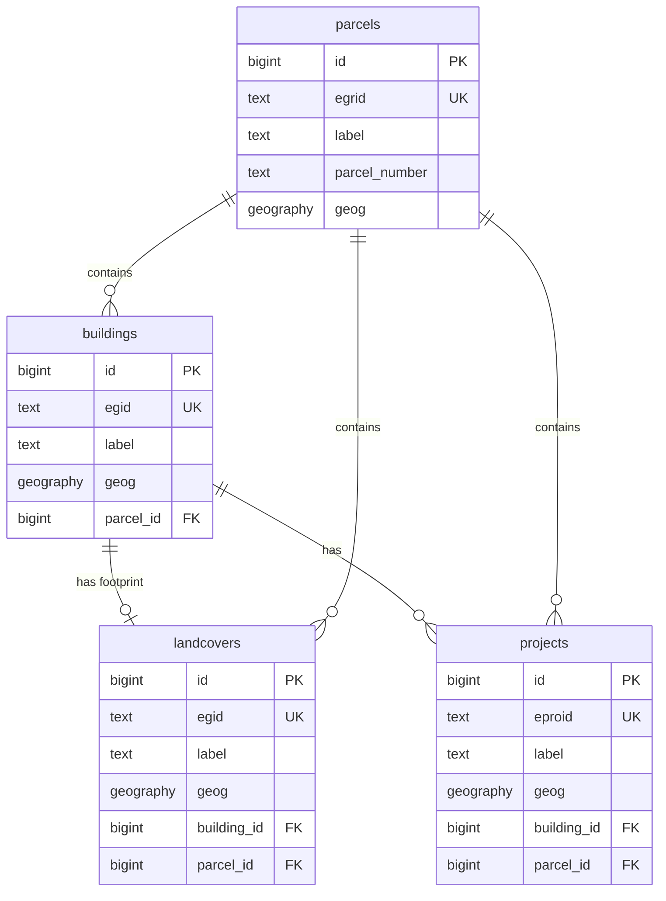

# Swiss Geodata Platform - Database Schema Design

## Project Overview

**Repository**: [swissALTI3D-Volumen](https://github.com/davras5/swissALTI3D-Volumen)
**Database**: PostGIS on Supabase
**Purpose**: Public-facing platform aggregating Swiss OGD (Open Government Data) for buildings, parcels, landcovers, and projects.
**Validation Sources**: GWR Merkmalskatalog 4.2, KKVA Richtlinie Detaillierungsgrad BB, DM.01-AV-CH

---

## Entity Relationship Overview

| Entity | Primary Key | Secondary Key | Geometry | Description |
|--------|-------------|---------------|----------|-------------|
| `buildings` | `id` | `egid` | Point | Individual buildings linked to parcels, with attributes from GWR and volumes from elevation models |
| `parcels` | `id` | `egrid` | Polygon | Land parcels from cadastral survey |
| `landcovers` | `id` | | Polygon | Landcover polygons including building footprints |
| `projects` | `id` | `eproid` | Polygon | Construction projects linked to buildings and parcels |



---

## Core Tables

### 1. buildings

Primary entity representing individual buildings.

#### System

| Column | Alias (EN) | Alias (DE) | Type | Constraints | Source | Description |
|--------|------------|------------|------|-------------|--------|-------------|
| `id` | ID | ID | `bigint` | `PRIMARY KEY, GENERATED ALWAYS AS IDENTITY` | System | System ID |
| `egid` | Building ID | Gebäudeidentifikator | `text` | `UNIQUE, CHECK (egid ~ '^[0-9]{1,9}$')` | GWR | Eidgenössischer Gebäudeidentifikator (EGID) |
| `label` | Label | Bezeichnung | `text` | | Derived | Display label for frontend |
| `source_fid` | Source Feature ID | Quell-Feature-ID | `text` | | Various | Feature ID from source system (for traceability) |
| `parcel_id` | Parcel | Grundstück | `bigint` | `REFERENCES parcels(id)` | Derived | Containing parcel |
| `geog` | Location | Standort | `geography(POINT, 4326)` | `NOT NULL` | GWR | Building centroid |
| `created_at` | Created | Erstellt | `timestamptz` | `NOT NULL DEFAULT NOW()` | System | Record creation timestamp |
| `updated_at` | Updated | Aktualisiert | `timestamptz` | `NOT NULL DEFAULT NOW()` | System | Record last update timestamp |

#### Address

| Column | Alias (EN) | Alias (DE) | Type | Constraints | Source | Description |
|--------|------------|------------|------|-------------|--------|-------------|
| `country` | Country | Land | `text` | `CHECK (country ~ '^[A-Z]{2}$')` | GWR | Country code (ISO 3166-1 alpha-2) |
| `region` | Region | Region | `text` | `CHECK (region ~ '^[A-Z]{2}$')` | GWR | Region code (canton in CH) |
| `city` | City | Ort | `text` | | GWR | City/locality |
| `postal_code` | Postal Code | Postleitzahl | `text` | `CHECK (postal_code ~ '^[0-9]{4}$')` | GWR | Postal code (4 digits in CH) |
| `street` | Street | Strasse | `text` | | GWR | Street name |
| `street_nr` | Street Number | Hausnummer | `text` | | GWR | Street number |

#### Classification

| Column | Alias (EN) | Alias (DE) | Type | Constraints | Source | Description |
|--------|------------|------------|------|-------------|--------|-------------|
| `status` | Status | Status | `building_status` | | GWR | Building status (GSTAT) |
| `category` | Category | Kategorie | `building_category` | | GWR | Building category (GKAT) |
| `class` | Class | Klasse | `text` | `CHECK (class ~ '^[0-9]{4}$')` | GWR | Building class code (GKLAS) |
| `roof_form` | Roof Form | Dachform | `roof_form` | | Derived | Roof form |

#### Construction

| Column | Alias (EN) | Alias (DE) | Type | Constraints | Source | Description |
|--------|------------|------------|------|-------------|--------|-------------|
| `construction_year` | Construction Year | Baujahr | `integer` | `CHECK (construction_year BETWEEN 1000 AND 2100)` | GWR | Year of construction (GBAUJ) |
| `renovation_year` | Renovation Year | Renovationsjahr | `integer` | `CHECK (renovation_year BETWEEN 1000 AND 2100)` | GWR | Year of last renovation |
| `dwellings_count` | Dwellings | Wohnungen | `integer` | `CHECK (dwellings_count >= 0)` | GWR | Number of dwellings |

#### Dimensions - Area

| Column | Alias (EN) | Alias (DE) | Type | Constraints | Source | Description |
|--------|------------|------------|------|-------------|--------|-------------|
| `area_footprint_m2` | Footprint Area | Gebäudegrundfläche | `numeric` | `CHECK (area_footprint_m2 >= 0)` | AV | Gebäudegrundfläche GGF (SIA 416) |
| `area_floor_total_m2` | Total Floor Area | Geschossfläche Total | `numeric` | `CHECK (area_floor_total_m2 >= 0)` | Derived | Geschossfläche GF total (SIA 416) |
| `area_floor_above_ground_m2` | Above Ground Floor Area | Oberirdische Geschossfläche | `numeric` | `CHECK (area_floor_above_ground_m2 >= 0)` | Derived | GF oberirdisch (SIA 416) |
| `area_floor_below_ground_m2` | Below Ground Floor Area | Unterirdische Geschossfläche | `numeric` | `CHECK (area_floor_below_ground_m2 >= 0)` | Derived | GF unterirdisch (SIA 416) |
| `area_floor_net_m2` | Net Floor Area | Nettogeschossfläche | `numeric` | `CHECK (area_floor_net_m2 >= 0)` | Derived | Nettogeschossfläche NGF (SIA 416) |
| `area_ebf_m2` | Energy Reference Area | Energiebezugsfläche | `numeric` | `CHECK (area_ebf_m2 >= 0)` | Derived | Energiebezugsfläche EBF (SIA 380) |
| `area_roof_m2` | Roof Area | Dachfläche | `numeric` | `CHECK (area_roof_m2 >= 0)` | Derived | Fläche Dach DAF (eBKP-H) |
| `area_wall_m2` | Wall Area | Aussenwandfläche | `numeric` | `CHECK (area_wall_m2 >= 0)` | Derived | Fläche Aussenwand AWF (eBKP-H) |
| `area_accuracy` | Area Accuracy | Flächen-Genauigkeit | `text` | | Derived | Accuracy and source of area data |

#### Dimensions - Floors

| Column | Alias (EN) | Alias (DE) | Type | Constraints | Source | Description |
|--------|------------|------------|------|-------------|--------|-------------|
| `floors_total` | Total Floors | Geschosse Total | `integer` | `CHECK (floors_total BETWEEN 1 AND 200)` | GWR | Anzahl Geschosse total (GASTW, SIA 416) |
| `floors_above` | Floors Above Ground | Oberirdische Geschosse | `integer` | `CHECK (floors_above >= 0)` | GWR | Geschosse oberirdisch (SIA 416) |
| `floors_below` | Floors Below Ground | Unterirdische Geschosse | `integer` | `CHECK (floors_below >= 0)` | GWR | Geschosse unterirdisch (SIA 416) |
| `floors_accuracy` | Floors Accuracy | Geschoss-Genauigkeit | `text` | | Derived | Accuracy and source of floor data |

#### Dimensions - Volume

| Column | Alias (EN) | Alias (DE) | Type | Constraints | Source | Description |
|--------|------------|------------|------|-------------|--------|-------------|
| `volume_total_m3` | Total Volume | Gesamtvolumen | `numeric` | `CHECK (volume_total_m3 >= 0)` | Derived | Gebäudevolumen GV total (SIA 416) |
| `volume_above_ground_m3` | Above Ground Volume | Oberirdisches Volumen | `numeric` | `CHECK (volume_above_ground_m3 >= 0)` | Derived | GV oberirdisch (SIA 416) |
| `volume_below_ground_m3` | Below Ground Volume | Unterirdisches Volumen | `numeric` | `CHECK (volume_below_ground_m3 >= 0)` | Derived | GV unterirdisch (SIA 416) |
| `volume_accuracy` | Volume Accuracy | Volumen-Genauigkeit | `text` | | Derived | Accuracy and source of volume data |

#### Dimensions - Height

| Column | Alias (EN) | Alias (DE) | Type | Constraints | Source | Description |
|--------|------------|------------|------|-------------|--------|-------------|
| `elevation_base_m` | Base Elevation | Terrainhöhe | `numeric` | | swissALTI3D | Terrain elevation at base (m.a.s.l.) |
| `height_mean_m` | Mean Height | Mittlere Höhe | `numeric` | `CHECK (height_mean_m >= 0)` | Derived | Mean building height |
| `height_max_m` | Max Height | Maximale Höhe | `numeric` | `CHECK (height_max_m >= 0)` | Derived | Maximum building height |

#### Energy

| Column | Alias (EN) | Alias (DE) | Type | Constraints | Source | Description |
|--------|------------|------------|------|-------------|--------|-------------|
| `heating_type` | Heating Type | Wärmeerzeuger Heizung | `text` | | GWR | Heating system type (GWAERZH) |
| `heating_source` | Heating Source | Energiequelle Heizung | `text` | | GWR | Heating energy source (GENH) |
| `water_heating_type` | Water Heating Type | Wärmeerzeuger Warmwasser | `text` | | GWR | Hot water system type (GWAERZW) |
| `water_heating_source` | Water Heating Source | Energiequelle Warmwasser | `text` | | GWR | Hot water energy source (GENW) |

#### Administrative

| Column | Alias (EN) | Alias (DE) | Type | Constraints | Source | Description |
|--------|------------|------------|------|-------------|--------|-------------|
| `municipality_nr` | Municipality Number | Gemeindenummer | `integer` | `CHECK (municipality_nr BETWEEN 1 AND 6999)` | GWR | BFS municipality number (GGDENR) |
| `municipality_name` | Municipality Name | Gemeindename | `text` | | GWR | Municipality name |

#### Heritage

| Column | Alias (EN) | Alias (DE) | Type | Constraints | Source | Description |
|--------|------------|------------|------|-------------|--------|-------------|
| `heritage_category` | Heritage Category | Schutzkategorie | `heritage_category` | | KGS | Protection category (A/B) |
| `heritage_inventory_nr` | Heritage Inventory Nr | KGS-Inventarnummer | `integer` | | KGS | Inventory number |

#### Zoning

| Column | Alias (EN) | Alias (DE) | Type | Constraints | Source | Description |
|--------|------------|------------|------|-------------|--------|-------------|
| `zone_main` | Main Zone | Hauptnutzungszone | `text` | | ARE | Main zoning classification |
| `zone_type` | Zone Type | Zonentyp | `text` | | ARE | Specific zone type |

---

### 2. parcels

Land parcels from cadastral survey.

#### System

| Column | Alias (EN) | Alias (DE) | Type | Constraints | Source | Description |
|--------|------------|------------|------|-------------|--------|-------------|
| `id` | ID | ID | `bigint` | `PRIMARY KEY, GENERATED ALWAYS AS IDENTITY` | System | System ID |
| `egrid` | Parcel ID | Grundstückidentifikator | `text` | `UNIQUE, CHECK (egrid ~ '^CH[0-9]{12}$')` | AV | E-GRID identifier |
| `egid` | Building ID | Gebäudeidentifikator | `text` | `CHECK (egid ~ '^[0-9]{1,9}$')` | GWR | Eidgenössischer Gebäudeidentifikator (EGID) - for parcels representing building footprints |
| `label` | Label | Bezeichnung | `text` | | Derived | Display label for frontend |
| `parcel_number` | Parcel Number | Parzellennummer | `text` | | AV | Local parcel number (Grundstücksnummer) |
| `source_fid` | Source Feature ID | Quell-Feature-ID | `text` | | AV | Feature ID from source system |
| `geog` | Geometry | Geometrie | `geography(POLYGON, 4326)` | `NOT NULL` | AV | Parcel boundary |
| `created_at` | Created | Erstellt | `timestamptz` | `NOT NULL DEFAULT NOW()` | System | Record creation timestamp |
| `updated_at` | Updated | Aktualisiert | `timestamptz` | `NOT NULL DEFAULT NOW()` | System | Record last update timestamp |

#### Classification

| Column | Alias (EN) | Alias (DE) | Type | Constraints | Source | Description |
|--------|------------|------------|------|-------------|--------|-------------|
| `status` | Status | Status | `parcel_status` | | AV | Parcel status |
| `type` | Type | Typ | `parcel_type` | | AV | Parcel type (LTYP) |

#### Dimensions

> **Note on area calculations:** Swiss cadastral surveys use **horizontal projection** (Horizontalprojektion) for all area measurements. This means the official `area_m2` represents the 2D planimetric area, not the actual 3D surface area. On sloped terrain, the true surface area can be significantly larger (e.g., +41% at 45° slope). The legally binding value from AV is always the projected area.

| Column | Alias (EN) | Alias (DE) | Type | Constraints | Source | Description |
|--------|------------|------------|------|-------------|--------|-------------|
| `area_m2` | Area | Fläche | `numeric` | `CHECK (area_m2 >= 0)` | AV | Parcel area GSF in m² (Grundstücksfläche). Legally binding (rechtskräftig) horizontal projection from cadastral survey. |
| `area_polygon_m2` | Polygon Area | Polygonfläche | `numeric` | `CHECK (area_polygon_m2 >= 0)` | Derived | 2D projected area calculated from polygon geometry (for validation against official area) |
| `area_surface_m2` | Surface Area | Oberflächenfläche | `numeric` | `CHECK (area_surface_m2 >= 0)` | Derived | 3D surface area in m², accounting for terrain slope (calculated from polygon draped on swissALTI3D DTM) |
| `area_ggf_m2` | Building Footprint Area | Gebäudegrundfläche | `numeric` | `CHECK (area_ggf_m2 >= 0)` | Derived | Sum of building footprints in m² (GGF). Based on 2D polygon area. |
| `area_uf_m2` | Surrounding Area | Umgebungsfläche | `numeric` | `CHECK (area_uf_m2 >= 0)` | Derived | Surrounding area in m² (UF, SIA 416). Based on 2D polygon area. |
| `area_buf_m2` | Processed Surrounding | Bearbeitete Umgebung | `numeric` | `CHECK (area_buf_m2 >= 0)` | Derived | Processed surrounding area in m² (BUF, SIA 416). Based on 2D polygon area. |
| `area_uuf_m2` | Unprocessed Surrounding | Unbearbeitete Umgebung | `numeric` | `CHECK (area_uuf_m2 >= 0)` | Derived | Unprocessed surrounding area in m² (UUF, SIA 416). Based on 2D polygon area. |
| `sealed_area_m2` | Sealed Area | Versiegelte Fläche | `numeric` | `CHECK (sealed_area_m2 >= 0)` | Derived | Sealed/impervious surface in m². Based on 2D polygon area. |

#### Administrative

| Column | Alias (EN) | Alias (DE) | Type | Constraints | Source | Description |
|--------|------------|------------|------|-------------|--------|-------------|
| `municipality_nr` | Municipality Number | Gemeindenummer | `integer` | `CHECK (municipality_nr BETWEEN 1 AND 6999)` | AV | BFS municipality number |
| `municipality_name` | Municipality Name | Gemeindename | `text` | | AV | Municipality name |

#### Zoning

| Column | Alias (EN) | Alias (DE) | Type | Constraints | Source | Description |
|--------|------------|------------|------|-------------|--------|-------------|
| `zone_main` | Main Zone | Hauptnutzungszone | `text` | | ARE | Main zoning classification |
| `zone_type` | Zone Type | Zonentyp | `text` | | ARE | Specific zone type |

---

### 3. landcovers

Landcover polygons from cadastral survey.

#### System

| Column | Alias (EN) | Alias (DE) | Type | Constraints | Source | Description |
|--------|------------|------------|------|-------------|--------|-------------|
| `id` | ID | ID | `bigint` | `PRIMARY KEY, GENERATED ALWAYS AS IDENTITY` | System | System ID |
| `label` | Label | Bezeichnung | `text` | | Derived | Display label for frontend |
| `source_fid` | Source Feature ID | Quell-Feature-ID | `text` | | AV | Feature ID from source system |
| `geog` | Geometry | Geometrie | `geography(POLYGON, 4326)` | `NOT NULL` | AV | Landcover polygon |
| `created_at` | Created | Erstellt | `timestamptz` | `NOT NULL DEFAULT NOW()` | System | Record creation timestamp |
| `updated_at` | Updated | Aktualisiert | `timestamptz` | `NOT NULL DEFAULT NOW()` | System | Record last update timestamp |

#### Classification

| Column | Alias (EN) | Alias (DE) | Type | Constraints | Source | Description |
|--------|------------|------------|------|-------------|--------|-------------|
| `status` | Status | Status | `text` | | AV | Landcover status |
| `type` | Type | Typ | `landcover_type` | `NOT NULL` | AV | Landcover classification |

#### Dimensions

| Column | Alias (EN) | Alias (DE) | Type | Constraints | Source | Description |
|--------|------------|------------|------|-------------|--------|-------------|
| `area_m2` | Area | Fläche | `numeric` | `CHECK (area_m2 >= 0)` | Derived | Surface area in m² |
| `volume_total_m3` | Volume | Volumen | `numeric` | `CHECK (volume_total_m3 >= 0)` | Derived | Building volume in m³ (for type=building) |
| `height_mean_m` | Mean Height | Mittlere Höhe | `numeric` | `CHECK (height_mean_m >= 0)` | Derived | Mean height in m (for type=building) |
| `height_max_m` | Max Height | Maximale Höhe | `numeric` | `CHECK (height_max_m >= 0)` | Derived | Maximum height in m (for type=building) |

#### Relations

| Column | Alias (EN) | Alias (DE) | Type | Constraints | Source | Description |
|--------|------------|------------|------|-------------|--------|-------------|
| `building_id` | Building | Gebäude | `bigint` | `REFERENCES buildings(id)` | Derived | Link to building (for footprints) |
| `parcel_id` | Parcel | Grundstück | `bigint` | `REFERENCES parcels(id)` | Derived | Containing parcel |

---

### 4. projects

Construction projects from GWR.

#### System

| Column | Alias (EN) | Alias (DE) | Type | Constraints | Source | Description |
|--------|------------|------------|------|-------------|--------|-------------|
| `id` | ID | ID | `bigint` | `PRIMARY KEY, GENERATED ALWAYS AS IDENTITY` | System | System ID |
| `eproid` | Project ID | Bauprojektidentifikator | `text` | `UNIQUE, CHECK (eproid ~ '^[0-9]{1,15}$')` | GWR | EPROID identifier |
| `label` | Label | Bezeichnung | `text` | | Derived | Display label for frontend |
| `source_fid` | Source Feature ID | Quell-Feature-ID | `text` | | GWR | Feature ID from source system |
| `geog` | Geometry | Geometrie | `geography(POLYGON, 4326)` | | GWR | Project perimeter |
| `created_at` | Created | Erstellt | `timestamptz` | `NOT NULL DEFAULT NOW()` | System | Record creation timestamp |
| `updated_at` | Updated | Aktualisiert | `timestamptz` | `NOT NULL DEFAULT NOW()` | System | Record last update timestamp |

#### Relations

| Column | Alias (EN) | Alias (DE) | Type | Constraints | Source | Description |
|--------|------------|------------|------|-------------|--------|-------------|
| `building_id` | Building | Gebäude | `bigint` | `REFERENCES buildings(id)` | GWR | Associated building (EGID) |
| `parcel_id` | Parcel | Grundstück | `bigint` | `REFERENCES parcels(id)` | Derived | Associated parcel |

#### Identification

| Column | Alias (EN) | Alias (DE) | Type | Constraints | Source | Description |
|--------|------------|------------|------|-------------|--------|-------------|
| `name` | Name | Bezeichnung | `text` | | GWR | Project name (PBEZ) |

#### Classification

| Column | Alias (EN) | Alias (DE) | Type | Constraints | Source | Description |
|--------|------------|------------|------|-------------|--------|-------------|
| `status` | Status | Status | `project_status` | | GWR | Project status (PSTAT) |
| `project_type` | Project Type | Projektart | `project_type` | | GWR | Type of construction (PARTBW) |
| `building_type` | Building Type | Bauwerkstyp | `text` | | GWR | Specific building type (PTYPBW) |

#### Timeline

| Column | Alias (EN) | Alias (DE) | Type | Constraints | Source | Description |
|--------|------------|------------|------|-------------|--------|-------------|
| `date_submitted` | Submitted | Beantragt | `date` | | GWR | Permit application date (PDATIN) |
| `date_approved` | Approved | Bewilligt | `date` | | GWR | Permit approval date (PDATOK) |
| `date_started` | Started | Baubeginn | `date` | | GWR | Construction start date (PDATBB) |
| `date_completed` | Completed | Abgeschlossen | `date` | | GWR | Completion date (PDATBE) |

#### Administrative

| Column | Alias (EN) | Alias (DE) | Type | Constraints | Source | Description |
|--------|------------|------------|------|-------------|--------|-------------|
| `municipality_nr` | Municipality Number | Gemeindenummer | `integer` | `CHECK (municipality_nr BETWEEN 1 AND 6999)` | GWR | BFS municipality number |

---

## Enumerations

### buildings.status (GSTAT) — GWR

From GWR Merkmalskatalog 4.2, Gebäudestatus.

| Code | Value | Alias (DE) | Alias (EN) |
|------|-------|------------|------------|
| 1001 | `planned` | projektiert | Planned |
| 1002 | `approved` | bewilligt | Approved |
| 1003 | `under_construction` | im Bau | Under construction |
| 1004 | `existing` | bestehend | Existing |
| 1005 | `unusable` | nicht nutzbar | Unusable |
| 1007 | `demolished` | abgebrochen | Demolished |
| 1008 | `not_realized` | nicht realisiert | Not realized |

```sql
CREATE TYPE building_status AS ENUM (
    'planned',           -- 1001
    'approved',          -- 1002
    'under_construction', -- 1003
    'existing',          -- 1004
    'unusable',          -- 1005
    'demolished',        -- 1007
    'not_realized'       -- 1008
);
```

---

### buildings.category (GKAT) — GWR

From GWR Merkmalskatalog 4.2, Gebäudekategorie.

| Code | Value | Alias (DE) | Alias (EN) |
|------|-------|------------|------------|
| 1010 | `provisional` | Provisorische Unterkunft | Provisional dwelling |
| 1020 | `single_family` | Einfamilienhaus | Single-family house |
| 1025 | `row_house` | Reiheneinfamilienhaus | Row house |
| 1030 | `multi_family` | Mehrfamilienhaus | Multi-family house |
| 1040 | `residential_mixed` | Wohngebäude mit Nebennutzung | Residential building with secondary use |
| 1060 | `residential_commercial` | Gebäude mit teilweiser Wohnnutzung | Building with partial residential use |
| 1080 | `commercial_only` | Gebäude ohne Wohnnutzung | Building without residential use |

```sql
CREATE TYPE building_category AS ENUM (
    'provisional',          -- 1010
    'single_family',        -- 1020
    'row_house',            -- 1025
    'multi_family',         -- 1030
    'residential_mixed',    -- 1040
    'residential_commercial', -- 1060
    'commercial_only'       -- 1080
);
```

---

### buildings.roof_form — Derived

Inferred from elevation models.

| Value | Alias (DE) | Alias (EN) |
|-------|------------|------------|
| `flat` | Flachdach | Flat roof |
| `gable` | Satteldach | Gable roof |
| `hip` | Walmdach | Hip roof |
| `mansard` | Mansarddach | Mansard roof |
| `pyramid` | Pyramidendach | Pyramid roof |
| `dome` | Kuppeldach | Dome roof |
| `shed` | Pultdach | Shed roof |
| `other` | Andere | Other |

```sql
CREATE TYPE roof_form AS ENUM (
    'flat',
    'gable',
    'hip',
    'mansard',
    'pyramid',
    'dome',
    'shed',
    'other'
);
```

---

### buildings.heritage_category — KGS

From KGS Inventar (Kulturgüterschutz).

| Value | Alias (DE) | Alias (EN) | Description |
|-------|------------|------------|-------------|
| `a` | Kategorie A | Category A | Objects of national importance |
| `b` | Kategorie B | Category B | Objects of regional importance |

```sql
CREATE TYPE heritage_category AS ENUM ('a', 'b');
```

---

### landcovers.type — AV

From DM.01-AV-CH, Bodenbedeckungsarten. 25 official types.

| Code | Value | Category (DE) | Alias (DE) | Alias (EN) |
|------|-------|---------------|------------|------------|
| 0 | `building` | Befestigte Flächen | Gebäude | Building |
| 1 | `hardened_area` | Befestigte Flächen | Befestigte Fläche | Hardened area |
| 2 | `greenhouse` | Befestigte Flächen | Gewächshaus | Greenhouse |
| 3 | `perennial_culture_shelter` | Befestigte Flächen | Unterstand Dauerkultur | Perennial culture shelter |
| 4 | `reservoir` | Befestigte Flächen | Wasserbecken | Reservoir |
| 5 | `other_hardened` | Befestigte Flächen | Übrige befestigte | Other hardened |
| 6 | `railway` | Verkehrsflächen | Bahn | Railway |
| 7 | `road_path` | Verkehrsflächen | Strasse/Weg | Road/Path |
| 8 | `field_meadow_pasture` | Landwirtschaft | Acker/Wiese/Weide | Field/Meadow/Pasture |
| 9 | `vineyard` | Landwirtschaft | Reben | Vineyard |
| 10 | `other_intensive_culture` | Landwirtschaft | Übrige Intensivkultur | Other intensive culture |
| 11 | `garden` | Landwirtschaft | Garten | Garden |
| 12 | `moor` | Humusierte Flächen | Moor | Moor |
| 13 | `other_humusised` | Humusierte Flächen | Übrige humusierte | Other humusised |
| 14 | `standing_water` | Gewässer | Stehendes Gewässer | Standing water |
| 15 | `flowing_water` | Gewässer | Fliessendes Gewässer | Flowing water |
| 16 | `reed_belt` | Gewässer | Schilfgürtel | Reed belt |
| 17 | `closed_forest` | Bestockte Flächen | Geschlossener Wald | Closed forest |
| 18 | `dense_wooded_pasture` | Bestockte Flächen | Übrige dicht bestockte | Dense wooded pasture |
| 19 | `open_wooded_pasture` | Bestockte Flächen | Übrige locker bestockte | Open wooded pasture |
| 20 | `other_wooded` | Bestockte Flächen | Gehölz | Other wooded |
| 21 | `rock` | Vegetationslose Flächen | Fels | Rock |
| 22 | `glacier_firn` | Vegetationslose Flächen | Gletscher/Firn | Glacier/Firn |
| 23 | `gravel_sand` | Vegetationslose Flächen | Kies/Sand | Gravel/Sand |
| 24 | `quarry_dump` | Vegetationslose Flächen | Abbau/Deponie | Quarry/Dump |
| 25 | `other_unvegetated` | Vegetationslose Flächen | Übrige vegetationslose | Other unvegetated |

```sql
CREATE TYPE landcover_type AS ENUM (
    'building',              -- 0
    'hardened_area',         -- 1
    'greenhouse',            -- 2
    'perennial_culture_shelter', -- 3
    'reservoir',             -- 4
    'other_hardened',        -- 5
    'railway',               -- 6
    'road_path',             -- 7
    'field_meadow_pasture',  -- 8
    'vineyard',              -- 9
    'other_intensive_culture', -- 10
    'garden',                -- 11
    'moor',                  -- 12
    'other_humusised',       -- 13
    'standing_water',        -- 14
    'flowing_water',         -- 15
    'reed_belt',             -- 16
    'closed_forest',         -- 17
    'dense_wooded_pasture',  -- 18
    'open_wooded_pasture',   -- 19
    'other_wooded',          -- 20
    'rock',                  -- 21
    'glacier_firn',          -- 22
    'gravel_sand',           -- 23
    'quarry_dump',           -- 24
    'other_unvegetated'      -- 25
);
```

---

### parcels.status — AV

From DM.01-AV-CH Liegenschaft model.

| Value | Alias (DE) | Alias (EN) |
|-------|------------|------------|
| `legally_valid` | Rechtskräftig | Legally valid |
| `in_progress` | In Bearbeitung | In progress |
| `projected` | Projektiert | Projected |

```sql
CREATE TYPE parcel_status AS ENUM (
    'legally_valid',
    'in_progress',
    'projected'
);
```

---

### parcels.type (LTYP) — AV/GWR

From GWR Merkmalskatalog, LTYP enumeration.

| Code | Value | Alias (DE) | Alias (EN) |
|------|-------|------------|------------|
| 1 | `property` | Liegenschaft | Property (land parcel) |
| 2 | `sdp_on_parcel` | Selbständiges und dauerndes Recht auf Grundstück | Independent and permanent right on a parcel |
| 3 | `mining_right` | Bergwerk | Mining concession |

```sql
CREATE TYPE parcel_type AS ENUM (
    'property',        -- 1
    'sdp_on_parcel',   -- 2
    'mining_right'     -- 3
);
```

---

### projects.status (PSTAT) — GWR

From GWR Merkmalskatalog 4.2, Bauprojektstatus.

| Code | Value | Alias (DE) | Alias (EN) | Trigger |
|------|-------|------------|------------|---------|
| 6701 | `submitted` | Baugesuch eingereicht | Building permit submitted | PDATIN set |
| 6702 | `approved` | Baubewilligung erteilt | Building permit granted | PDATOK set |
| 6703 | `under_construction` | Projekt baubegonnen | Construction started | PDATBB set |
| 6704 | `completed` | Projekt abgeschlossen | Project completed | PDATBE set |
| 6706 | `suspended` | Projekt sistiert | Project suspended | PDATSIST set |
| 6707 | `rejected` | Baugesuch abgelehnt | Permit rejected | PDATABL set |
| 6708 | `not_realized` | Projekt nicht realisiert | Not realized (permit expired) | PDATANN set |
| 6709 | `withdrawn` | Projekt zurückgezogen | Permit withdrawn by applicant | PDATRZG set |

```sql
CREATE TYPE project_status AS ENUM (
    'submitted',          -- 6701
    'approved',           -- 6702
    'under_construction', -- 6703
    'completed',          -- 6704
    'suspended',          -- 6706
    'rejected',           -- 6707
    'not_realized',       -- 6708
    'withdrawn'           -- 6709
);
```

---

### projects.project_type (PARTBW) — GWR

Art der Bauwerke from GWR.

| Code | Value | Alias (DE) | Alias (EN) |
|------|-------|------------|------------|
| 6010 | `civil_engineering` | Tiefbau | Civil engineering |
| 6011 | `building` | Hochbau | Building construction |
| 6012 | `special_structure` | Sonderbau | Special structure |

```sql
CREATE TYPE project_type AS ENUM (
    'civil_engineering',  -- 6010
    'building',           -- 6011
    'special_structure'   -- 6012
);
```

---

### projects.building_type (PTYPBW) — GWR

Typ der Bauwerke. 48 official types in 11 groups.

#### Infrastructure: Supply (621x)

| Code | Alias (DE) | Alias (EN) |
|------|------------|------------|
| 6211 | Wasserversorgungsanlagen | Water supply facilities |
| 6212 | Elektrizitätswerke und -netze | Electricity works and networks |
| 6213 | Gaswerke und -netze | Gas works and networks |
| 6214 | Fernheizungsanlagen | District heating facilities |
| 6219 | Übrige Versorgungsanlagen | Other supply facilities |

#### Infrastructure: Disposal (622x)

| Code | Alias (DE) | Alias (EN) |
|------|------------|------------|
| 6221 | Wasserentsorgungsanlagen | Water disposal facilities |
| 6222 | Kehrichtentsorgungsanlagen | Waste disposal facilities |
| 6223 | Übrige Entsorgungsanlagen | Other disposal facilities |

#### Residential (627x)

| Code | Alias (DE) | Alias (EN) |
|------|------------|------------|
| 6271 | Einfamilienhäuser freistehend | Single-family houses, detached |
| 6272 | Einfamilienhäuser angebaut | Single-family houses, attached |
| 6273 | Mehrfamilienhäuser | Multi-family houses |
| 6274 | Wohngebäude mit Nebennutzung | Residential with secondary use |
| 6276 | Wohnheime ohne Pflegedienste | Residential homes (without care) |
| 6278 | Garagen, Parkplätze, Einstellhallen (bei Wohngebäuden) | Garages, parking, covered parking (with residential) |
| 6279 | Übrige Bauten (bei Wohngebäuden) | Other structures (with residential) |

**Reference**: [GWR Merkmalskatalog 4.2](https://www.housing-stat.ch/files/881-2200.pdf) for complete PTYPBW enumeration.

---

## Reference Tables

### landcover_types — AV

Lookup table for landcover classifications with multilingual names.

#### System

| Column | Alias (EN) | Alias (DE) | Type | Constraints | Source | Description |
|--------|------------|------------|------|-------------|--------|-------------|
| `code` | Code | Code | `text` | `PRIMARY KEY` | AV | Landcover type code |
| `av_code` | AV Code | AV-Code | `integer` | `UNIQUE NOT NULL` | AV | Numeric code from DM.01-AV-CH |
| `category` | Category | Kategorie | `text` | `NOT NULL` | AV | Landcover category |

#### Names

| Column | Alias (EN) | Alias (DE) | Type | Constraints | Source | Description |
|--------|------------|------------|------|-------------|--------|-------------|
| `name_de` | Name (DE) | Name (DE) | `text` | `NOT NULL` | AV | German name |
| `name_fr` | Name (FR) | Name (FR) | `text` | | AV | French name |
| `name_it` | Name (IT) | Name (IT) | `text` | | AV | Italian name |
| `name_en` | Name (EN) | Name (EN) | `text` | `NOT NULL` | AV | English name |

---

### municipalities — BFS

BFS municipality register.

#### System

| Column | Alias (EN) | Alias (DE) | Type | Constraints | Source | Description |
|--------|------------|------------|------|-------------|--------|-------------|
| `bfs_nr` | BFS Number | BFS-Nummer | `integer` | `PRIMARY KEY, CHECK (bfs_nr BETWEEN 1 AND 6999)` | BFS | BFS municipality number |
| `name` | Name | Name | `text` | `NOT NULL` | BFS | Municipality name |

#### Administrative

| Column | Alias (EN) | Alias (DE) | Type | Constraints | Source | Description |
|--------|------------|------------|------|-------------|--------|-------------|
| `region` | Region | Region | `text` | `CHECK (region ~ '^[A-Z]{2}$')` | BFS | Canton code |
| `district` | District | Bezirk | `text` | | BFS | District name |

---

## Data Sources

Primary data access is through the **Federal Spatial Data Infrastructure (FSDI)** via geo.admin.ch services.

| Key | Dataset | Provider | Layer ID | Access | Update | Content |
|-----|---------|----------|----------|--------|--------|---------|
| GWR | Gebäude- und Wohnungsregister | BFS | `ch.bfs.gebaeude_wohnungs_register` | OGD | Daily | Building attributes, dwellings, addresses |
| GWR-GENH | GWR Energie-/Wärmequelle Heizung | BFS | `ch.bfs.gebaeude_wohnungs_register_waermequelle_heizung` | OGD | Daily | Heating energy sources |
| AV | Amtliche Vermessung | Cantonal Offices | via geodienste.ch | OGD | Varies | Footprints, parcels, landcovers |
| swissALTI3D | swissALTI3D | swisstopo | `ch.swisstopo.swissalti3d` | OGD | Annual | Terrain elevation model (DTM) |
| swissSURFACE3D | swissSURFACE3D | swisstopo | `ch.swisstopo.swisssurface3d` | OGD | Annual | Surface elevation model (DSM) |
| swissBUILDINGS3D | swissBUILDINGS3D | swisstopo | `ch.swisstopo.swissbuildings3d` | OGD | Annual | 3D building models |
| swissBOUNDARIES3D | swissBOUNDARIES3D | swisstopo | `ch.swisstopo.swissboundaries3d-gemeinde-flaeche.fill` | OGD | Annual | Municipality boundaries |
| ARE | Bauzonen Schweiz | ARE | `ch.are.bauzonen` | OGD | Annual | Zoning classifications |
| KGS | KGS Inventar | BABS | `ch.babs.kulturgueter` | OGD | Occasional | Heritage protection (A/B) |

### API Endpoints

| Service | URL | Description |
|---------|-----|-------------|
| Tech Docs | https://docs.geo.admin.ch | API documentation and guides |
| Layer Catalog | https://api3.geo.admin.ch/rest/services/ech/MapServer | Complete list of available layers |
| Identify | https://api3.geo.admin.ch/rest/services/api/MapServer/identify | Query features by location |
| Find | https://api3.geo.admin.ch/rest/services/api/MapServer/find | Search features by attribute |
| Search | https://api3.geo.admin.ch/rest/services/api/SearchServer | Full-text search (addresses, layers, features) |
| WMS | https://wms.geo.admin.ch | OGC Web Map Service |
| WMTS | https://wmts.geo.admin.ch | OGC Web Map Tile Service |
| STAC | https://data.geo.admin.ch/api/stac/v1 | Spatiotemporal Asset Catalog for downloads |
| Data Browser | https://data.geo.admin.ch/browser | Interactive data download |

### Example API Calls

```bash
# Get building by EGID
curl "https://api3.geo.admin.ch/rest/services/api/MapServer/find?layer=ch.bfs.gebaeude_wohnungs_register&searchText=1231641&searchField=egid&returnGeometry=true"

# Identify features at coordinates (LV95)
curl "https://api3.geo.admin.ch/rest/services/api/MapServer/identify?geometryType=esriGeometryPoint&geometry=2600000,1200000&layers=all:ch.bfs.gebaeude_wohnungs_register&tolerance=50&returnGeometry=true&sr=2056"

# Search for address
curl "https://api3.geo.admin.ch/rest/services/api/SearchServer?searchText=bundesplatz%203%20bern&type=locations"
```

---

## Key Documentation

| Document | URL |
|----------|-----|
| geo.admin.ch Tech Docs | https://docs.geo.admin.ch |
| GWR Merkmalskatalog 4.2 | https://www.housing-stat.ch/files/881-2200.pdf |
| GWR Public Data | https://www.housing-stat.ch/__publicdata |
| KKVA Richtlinie Detaillierungsgrad BB | https://www.cadastre-manual.admin.ch/dam/de/sd-web/J969zG4lGjuV/Richtlinie-Detaillierungsgrad-BB-de.pdf |
| Weisung AV-GWR Gebäudeerfassung | https://www.housing-stat.ch/files/1754-2300.pdf |
| Cadastre Manual | https://www.cadastre-manual.admin.ch |
| swisstopo Products | https://www.swisstopo.admin.ch/de/geodata |

## SQL

```sql

-- Swiss Geodata Platform - Database Schema
-- PostGIS on Supabase
-- Version: 0.1.0 (Prototype)

-- =============================================================================
-- PARCELS
-- Land parcels from cadastral survey (Amtliche Vermessung)
-- =============================================================================

CREATE TABLE public.parcels (
  -- System
  id bigint GENERATED ALWAYS AS IDENTITY PRIMARY KEY,
  label text,
  egrid text,
  parcel_number text,
  source_fid text,
  geog geography(POLYGON, 4326),
  created_at timestamptz DEFAULT now(),
  updated_at timestamptz DEFAULT now(),

  -- Classification
  status text,
  type text,

  -- Dimensions
  area_m2 numeric,
  area_polygon_m2 numeric,
  area_surface_m2 numeric,
  area_ggf_m2 numeric,
  area_uf_m2 numeric,
  area_buf_m2 numeric,
  area_uuf_m2 numeric,
  sealed_area_m2 numeric,

  -- Admin
  municipality_nr integer,
  municipality_name text,

  -- Zoning
  zone_main text,
  zone_type text
);

-- =============================================================================
-- BUILDINGS
-- Individual buildings linked to parcels
-- =============================================================================

CREATE TABLE public.buildings (
  -- System
  id bigint GENERATED ALWAYS AS IDENTITY PRIMARY KEY,
  label text,
  egid text,
  source_fid text,
  parcel_id bigint REFERENCES public.parcels(id),
  geog geography(POINT, 4326),
  created_at timestamptz DEFAULT now(),
  updated_at timestamptz DEFAULT now(),

  -- Address
  country text,
  region text,
  city text,
  postal_code text,
  street text,
  street_nr text,

  -- Classification
  status text,
  category text,
  class text,
  roof_form text,

  -- Construction
  construction_year integer,
  renovation_year integer,
  dwellings_count integer,

  -- Area
  area_footprint_m2 numeric,
  area_floor_total_m2 numeric,
  area_floor_above_ground_m2 numeric,
  area_floor_below_ground_m2 numeric,
  area_floor_net_m2 numeric,
  area_ebf_m2 numeric,
  area_roof_m2 numeric,
  area_wall_m2 numeric,
  area_accuracy text,

  -- Floors
  floors_total integer,
  floors_above integer,
  floors_below integer,
  floors_accuracy text,

  -- Volume
  volume_total_m3 numeric,
  volume_above_ground_m3 numeric,
  volume_below_ground_m3 numeric,
  volume_accuracy text,

  -- Height
  elevation_base_m numeric,
  height_mean_m numeric,
  height_max_m numeric,

  -- Energy
  heating_type text,
  heating_source text,
  water_heating_type text,
  water_heating_source text,

  -- Admin
  municipality_nr integer,
  municipality_name text,

  -- Heritage
  heritage_category text,
  heritage_inventory_nr integer,

  -- Zoning
  zone_main text,
  zone_type text
);

-- =============================================================================
-- LANDCOVERS
-- Landcover polygons from cadastral survey (Bodenbedeckung)
-- =============================================================================

CREATE TABLE public.landcovers (
  -- System
  id bigint GENERATED ALWAYS AS IDENTITY PRIMARY KEY,
  label text,
  egid text,
  source_fid text,
  geog geography(POLYGON, 4326),
  created_at timestamptz DEFAULT now(),
  updated_at timestamptz DEFAULT now(),

  -- Classification
  status text,
  type text,

  -- Dimensions
  area_m2 numeric,
  volume_total_m3 numeric,
  height_mean_m numeric,
  height_max_m numeric,

  -- Relations
  building_id bigint REFERENCES public.buildings(id),
  parcel_id bigint REFERENCES public.parcels(id)
);

-- =============================================================================
-- PROJECTS
-- Construction projects from GWR (Bauprojekte)
-- =============================================================================

CREATE TABLE public.projects (
  -- System
  id bigint GENERATED ALWAYS AS IDENTITY PRIMARY KEY,
  label text,
  eproid text,
  source_fid text,
  geog geography(POLYGON, 4326),
  created_at timestamptz DEFAULT now(),
  updated_at timestamptz DEFAULT now(),

  -- Relations
  building_id bigint REFERENCES public.buildings(id),
  parcel_id bigint REFERENCES public.parcels(id),

  -- Classification
  status text,
  project_type text,
  building_type text,

  -- Timeline
  date_submitted date,
  date_approved date,
  date_started date,
  date_completed date,

  -- Admin
  municipality_nr integer
);

```

