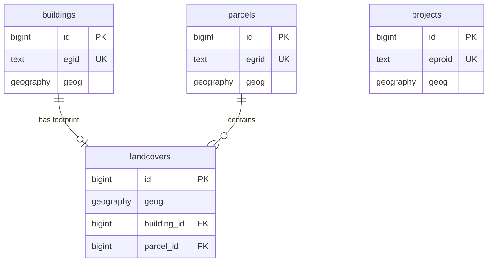

# Swiss Geodata Platform - Database Schema Design

## Project Overview

**Repository**: [swissALTI3D-Volumen](https://github.com/davras5/swissALTI3D-Volumen)
**Database**: PostGIS on Supabase
**Purpose**: Public-facing platform aggregating Swiss OGD (Open Government Data) for buildings, parcels, landcovers, and projects.
**Validation Sources**: GWR Merkmalskatalog 4.2, KKVA Richtlinie Detaillierungsgrad BB, DM.01-AV-CH

---

## Entity Relationship Overview

| Entity | Primary Key | Secondary Key | Geometry | Description |
|--------|-------------|---------------|----------|-------------|
| `buildings` | `id` | `egid` | Point | Individual buildings with attributes from GWR, volumes from elevation models |
| `parcels` | `id` | `egrid` | Polygon | Land parcels from cadastral survey |
| `landcovers` | `id` | | Polygon | Landcover polygons including building footprints |
| `projects` | `id` | `eproid` | Polygon | Construction projects (limited OGD availability) |



---

## Core Tables

### 1. buildings

Primary entity representing individual buildings.

#### System

| Column | Alias (EN) | Alias (DE) | Type | Constraints | Source | Description |
|--------|------------|------------|------|-------------|--------|-------------|
| `id` | ID | ID | `bigint` | `PRIMARY KEY, GENERATED ALWAYS AS IDENTITY` | System | System ID |
| `egid` | Building ID | Gebäudeidentifikator | `text` | `UNIQUE, CHECK (egid ~ '^[0-9]{1,9}$')` | GWR | Eidgenössischer Gebäudeidentifikator (EGID) |
| `source_fid` | Source Feature ID | Quell-Feature-ID | `text` | | Various | Feature ID from source system (for traceability) |
| `geog` | Location | Standort | `geography(POINT, 4326)` | `NOT NULL` | GWR | Building centroid |
| `created_at` | Created | Erstellt | `timestamptz` | `NOT NULL DEFAULT NOW()` | System | Record creation timestamp |
| `updated_at` | Updated | Aktualisiert | `timestamptz` | `NOT NULL DEFAULT NOW()` | System | Record last update timestamp |

#### Address

| Column | Alias (EN) | Alias (DE) | Type | Constraints | Source | Description |
|--------|------------|------------|------|-------------|--------|-------------|
| `country` | Country | Land | `text` | `CHECK (country ~ '^[A-Z]{2}$')` | GWR | Country code (ISO 3166-1 alpha-2) |
| `region` | Region | Region | `text` | `CHECK (region ~ '^[A-Z]{2}$')` | GWR | Region code (canton in CH) |
| `city` | City | Ort | `text` | | GWR | City/locality |
| `postal_code` | Postal Code | Postleitzahl | `text` | `CHECK (postal_code ~ '^[0-9]{4}$')` | GWR | Postal code (4 digits in CH) |
| `street` | Street | Strasse | `text` | | GWR | Street name |
| `street_nr` | Street Number | Hausnummer | `text` | | GWR | Street number |

#### Classification

| Column | Alias (EN) | Alias (DE) | Type | Constraints | Source | Description |
|--------|------------|------------|------|-------------|--------|-------------|
| `status` | Status | Status | `building_status` | | GWR | Building status (GSTAT) |
| `category` | Category | Kategorie | `building_category` | | GWR | Building category (GKAT) |
| `class` | Class | Klasse | `text` | `CHECK (class ~ '^[0-9]{4}$')` | GWR | Building class code (GKLAS) |
| `roof_form` | Roof Form | Dachform | `roof_form` | | Derived | Roof form |

#### Construction

| Column | Alias (EN) | Alias (DE) | Type | Constraints | Source | Description |
|--------|------------|------------|------|-------------|--------|-------------|
| `construction_year` | Construction Year | Baujahr | `integer` | `CHECK (construction_year BETWEEN 1000 AND 2100)` | GWR | Year of construction (GBAUJ) |
| `renovation_year` | Renovation Year | Renovationsjahr | `integer` | `CHECK (renovation_year BETWEEN 1000 AND 2100)` | GWR | Year of last renovation |
| `dwellings_count` | Dwellings | Wohnungen | `integer` | `CHECK (dwellings_count >= 0)` | GWR | Number of dwellings |

#### Dimensions - Volume

| Column | Alias (EN) | Alias (DE) | Type | Constraints | Source | Description |
|--------|------------|------------|------|-------------|--------|-------------|
| `volume_total_m3` | Total Volume | Gesamtvolumen | `numeric` | `CHECK (volume_total_m3 >= 0)` | Derived | Gebäudevolumen GV total (SIA 416) |
| `volume_above_ground_m3` | Above Ground Volume | Oberirdisches Volumen | `numeric` | `CHECK (volume_above_ground_m3 >= 0)` | Derived | GV oberirdisch (SIA 416) |
| `volume_below_ground_m3` | Below Ground Volume | Unterirdisches Volumen | `numeric` | `CHECK (volume_below_ground_m3 >= 0)` | Derived | GV unterirdisch (SIA 416) |
| `volume_accuracy` | Volume Accuracy | Volumen-Genauigkeit | `text` | | Derived | Accuracy and source of volume data |

#### Dimensions - Height

| Column | Alias (EN) | Alias (DE) | Type | Constraints | Source | Description |
|--------|------------|------------|------|-------------|--------|-------------|
| `elevation_base_m` | Base Elevation | Terrainhöhe | `numeric` | | swissALTI3D | Terrain elevation at base (m.a.s.l.) |
| `height_mean_m` | Mean Height | Mittlere Höhe | `numeric` | `CHECK (height_mean_m >= 0)` | Derived | Mean building height |
| `height_max_m` | Max Height | Maximale Höhe | `numeric` | `CHECK (height_max_m >= 0)` | Derived | Maximum building height |

#### Dimensions - Floors

| Column | Alias (EN) | Alias (DE) | Type | Constraints | Source | Description |
|--------|------------|------------|------|-------------|--------|-------------|
| `floors_total` | Total Floors | Geschosse Total | `integer` | `CHECK (floors_total BETWEEN 1 AND 200)` | GWR | Anzahl Geschosse total (GASTW, SIA 416) |
| `floors_above` | Floors Above Ground | Oberirdische Geschosse | `integer` | `CHECK (floors_above >= 0)` | GWR | Geschosse oberirdisch (SIA 416) |
| `floors_below` | Floors Below Ground | Unterirdische Geschosse | `integer` | `CHECK (floors_below >= 0)` | GWR | Geschosse unterirdisch (SIA 416) |
| `floors_accuracy` | Floors Accuracy | Geschoss-Genauigkeit | `text` | | Derived | Accuracy and source of floor data |

#### Dimensions - Area

| Column | Alias (EN) | Alias (DE) | Type | Constraints | Source | Description |
|--------|------------|------------|------|-------------|--------|-------------|
| `area_footprint_m2` | Footprint Area | Grundfläche | `numeric` | `CHECK (area_footprint_m2 >= 0)` | AV | Gebäudegrundfläche GGF (SIA 416) |
| `area_floor_total_m2` | Total Floor Area | Geschossfläche Total | `numeric` | `CHECK (area_floor_total_m2 >= 0)` | Derived | Geschossfläche GF total (SIA 416) |
| `area_floor_above_ground_m2` | Above Ground Floor Area | Oberirdische Geschossfläche | `numeric` | `CHECK (area_floor_above_ground_m2 >= 0)` | Derived | GF oberirdisch (SIA 416) |
| `area_floor_below_ground_m2` | Below Ground Floor Area | Unterirdische Geschossfläche | `numeric` | `CHECK (area_floor_below_ground_m2 >= 0)` | Derived | GF unterirdisch (SIA 416) |
| `area_floor_net_m2` | Net Floor Area | Netto-Geschossfläche | `numeric` | `CHECK (area_floor_net_m2 >= 0)` | Derived | Netto-Geschossfläche NGF (SIA 416) |
| `area_ebf_m2` | Energy Reference Area | Energiebezugsfläche | `numeric` | `CHECK (area_ebf_m2 >= 0)` | Derived | Energiebezugsfläche EBF (SIA 380) |
| `area_roof_m2` | Roof Area | Dachfläche | `numeric` | `CHECK (area_roof_m2 >= 0)` | Derived | Fläche Dach DAF (eBKP-H) |
| `area_wall_m2` | Wall Area | Aussenwandfläche | `numeric` | `CHECK (area_wall_m2 >= 0)` | Derived | Fläche Aussenwand AWF (eBKP-H) |
| `area_accuracy` | Area Accuracy | Flächen-Genauigkeit | `text` | | Derived | Accuracy and source of area data |

#### Energy

| Column | Alias (EN) | Alias (DE) | Type | Constraints | Source | Description |
|--------|------------|------------|------|-------------|--------|-------------|
| `heating_type` | Heating Type | Wärmeerzeuger Heizung | `text` | | GWR | Heating system type (GWAERZH) |
| `heating_source` | Heating Source | Energiequelle Heizung | `text` | | GWR | Heating energy source (GENH) |
| `water_heating_type` | Water Heating Type | Wärmeerzeuger Warmwasser | `text` | | GWR | Hot water system type (GWAERZW) |
| `water_heating_source` | Water Heating Source | Energiequelle Warmwasser | `text` | | GWR | Hot water energy source (GENW) |

#### Administrative

| Column | Alias (EN) | Alias (DE) | Type | Constraints | Source | Description |
|--------|------------|------------|------|-------------|--------|-------------|
| `municipality_nr` | Municipality Number | Gemeindenummer | `integer` | `CHECK (municipality_nr BETWEEN 1 AND 6999)` | GWR | BFS municipality number (GGDENR) |
| `municipality_name` | Municipality Name | Gemeindename | `text` | | GWR | Municipality name |

#### Heritage

| Column | Alias (EN) | Alias (DE) | Type | Constraints | Source | Description |
|--------|------------|------------|------|-------------|--------|-------------|
| `heritage_category` | Heritage Category | Schutzkategorie | `heritage_category` | | KGS | Protection category (A/B) |
| `heritage_inventory_nr` | Heritage Inventory Nr | KGS-Inventarnummer | `integer` | | KGS | Inventory number |

#### Zoning

| Column | Alias (EN) | Alias (DE) | Type | Constraints | Source | Description |
|--------|------------|------------|------|-------------|--------|-------------|
| `zone_designation` | Zone Designation | Zonenbezeichnung | `text` | | ARE | Zoning designation |
| `zone_usage` | Zone Usage | Zonennutzung | `text` | | ARE | Permitted zone usage |

---

### 2. parcels

Land parcels from the official cadastral survey (Amtliche Vermessung).

#### System

| Column | Alias (EN) | Alias (DE) | Type | Constraints | Source | Description |
|--------|------------|------------|------|-------------|--------|-------------|
| `id` | ID | ID | `bigint` | `PRIMARY KEY, GENERATED ALWAYS AS IDENTITY` | System | System ID |
| `egrid` | Parcel ID | Grundstückidentifikator | `text` | `UNIQUE, CHECK (egrid ~ '^CH[0-9]{12,14}$')` | AV | Eidgenössischer Grundstückidentifikator (EGRID) |
| `source_fid` | Source Feature ID | Quell-Feature-ID | `text` | | AV | Feature ID from source system (for traceability) |
| `geog` | Geometry | Geometrie | `geography(POLYGON, 4326)` | `NOT NULL` | AV | Parcel geometry |
| `created_at` | Created | Erstellt | `timestamptz` | `NOT NULL DEFAULT NOW()` | System | Record creation timestamp |
| `updated_at` | Updated | Aktualisiert | `timestamptz` | `NOT NULL DEFAULT NOW()` | System | Record last update timestamp |

#### Classification

| Column | Alias (EN) | Alias (DE) | Type | Constraints | Source | Description |
|--------|------------|------------|------|-------------|--------|-------------|
| `status` | Status | Status | `parcel_status` | | AV | Parcel status |
| `type` | Type | Typ | `parcel_type` | | AV | Parcel type (LTYP) |

#### Identification

| Column | Alias (EN) | Alias (DE) | Type | Constraints | Source | Description |
|--------|------------|------------|------|-------------|--------|-------------|
| `parcel_nr` | Parcel Number | Parzellennummer | `text` | `NOT NULL` | AV | Parcel number (per municipality) |
| `municipality_nr` | Municipality Number | Gemeindenummer | `integer` | `CHECK (municipality_nr BETWEEN 1 AND 6999)` | AV | BFS municipality number |
| `municipality_name` | Municipality Name | Gemeindename | `text` | | AV | Municipality name |

#### Dimensions - Area

| Column | Alias (EN) | Alias (DE) | Type | Constraints | Source | Description |
|--------|------------|------------|------|-------------|--------|-------------|
| `area_parcel_m2` | Parcel Area | Grundstücksfläche | `numeric` | `CHECK (area_parcel_m2 >= 0)` | AV | Grundstücksfläche GSF (SIA 416) |
| `area_footprint_m2` | Building Footprint | Gebäudegrundfläche | `numeric` | `CHECK (area_footprint_m2 >= 0)` | Derived | Gebäudegrundfläche GGF (SIA 416), sum of building footprints |
| `area_surrounding_m2` | Surrounding Area | Umgebungsfläche | `numeric` | `CHECK (area_surrounding_m2 >= 0)` | Derived | Umgebungsfläche UF (SIA 416) |
| `area_surrounding_processed_m2` | Processed Surrounding | Bearbeitete Umgebung | `numeric` | `CHECK (area_surrounding_processed_m2 >= 0)` | Derived | Bearbeitete Umgebungsfläche BUF (SIA 416) |
| `area_surrounding_unprocessed_m2` | Unprocessed Surrounding | Unbearbeitete Umgebung | `numeric` | `CHECK (area_surrounding_unprocessed_m2 >= 0)` | Derived | Unbearbeitete Umgebungsfläche UUF (SIA 416) |

---

### 3. landcovers

Landcover polygons from Amtliche Vermessung. Building footprints are a specific type.

#### System

| Column | Alias (EN) | Alias (DE) | Type | Constraints | Source | Description |
|--------|------------|------------|------|-------------|--------|-------------|
| `id` | ID | ID | `bigint` | `PRIMARY KEY, GENERATED ALWAYS AS IDENTITY` | System | System ID |
| `source_fid` | Source Feature ID | Quell-Feature-ID | `text` | | AV | Feature ID from source system (for traceability) |
| `geog` | Geometry | Geometrie | `geography(POLYGON, 4326)` | `NOT NULL` | AV | Landcover geometry |
| `created_at` | Created | Erstellt | `timestamptz` | `NOT NULL DEFAULT NOW()` | System | Record creation timestamp |
| `updated_at` | Updated | Aktualisiert | `timestamptz` | `NOT NULL DEFAULT NOW()` | System | Record last update timestamp |

#### Classification

| Column | Alias (EN) | Alias (DE) | Type | Constraints | Source | Description |
|--------|------------|------------|------|-------------|--------|-------------|
| `status` | Status | Status | `text` | | AV | Landcover status |
| `type` | Type | Typ | `landcover_type` | `NOT NULL` | AV | Landcover type (BB-Art) |

#### Relations

| Column | Alias (EN) | Alias (DE) | Type | Constraints | Source | Description |
|--------|------------|------------|------|-------------|--------|-------------|
| `building_id` | Building | Gebäude | `bigint` | `REFERENCES buildings(id) ON DELETE SET NULL` | Derived | Associated building (for footprints only) |
| `parcel_id` | Parcel | Parzelle | `bigint` | `REFERENCES parcels(id) ON DELETE SET NULL` | Derived | Associated parcel |

#### Dimensions

| Column | Alias (EN) | Alias (DE) | Type | Constraints | Source | Description |
|--------|------------|------------|------|-------------|--------|-------------|
| `area_m2` | Area | Fläche | `numeric` | `CHECK (area_m2 >= 0)` | Derived | Surface area |
| `volume_total_m3` | Volume | Volumen | `numeric` | `CHECK (volume_total_m3 >= 0)` | Derived | Volume (for buildings) |
| `height_mean_m` | Mean Height | Mittlere Höhe | `numeric` | `CHECK (height_mean_m >= 0)` | Derived | Mean height (for buildings) |
| `height_max_m` | Max Height | Maximale Höhe | `numeric` | `CHECK (height_max_m >= 0)` | Derived | Maximum height (for buildings) |

---

### 4. projects

Construction projects. Note: Limited OGD available - primarily cantonal building permit data where published.

#### System

| Column | Alias (EN) | Alias (DE) | Type | Constraints | Source | Description |
|--------|------------|------------|------|-------------|--------|-------------|
| `id` | ID | ID | `bigint` | `PRIMARY KEY, GENERATED ALWAYS AS IDENTITY` | System | System ID |
| `eproid` | Project ID | Bauprojektidentifikator | `text` | `UNIQUE, CHECK (eproid ~ '^[0-9]{1,9}$')` | GWR | Eidgenössischer Bauprojektidentifikator (EPROID) |
| `source_fid` | Source Feature ID | Quell-Feature-ID | `text` | | Various | Feature ID from source system (for traceability) |
| `geog` | Geometry | Geometrie | `geography(POLYGON, 4326)` | | Various | Project perimeter |
| `created_at` | Created | Erstellt | `timestamptz` | `NOT NULL DEFAULT NOW()` | System | Record creation timestamp |
| `updated_at` | Updated | Aktualisiert | `timestamptz` | `NOT NULL DEFAULT NOW()` | System | Record last update timestamp |

#### Classification

| Column | Alias (EN) | Alias (DE) | Type | Constraints | Source | Description |
|--------|------------|------------|------|-------------|--------|-------------|
| `status` | Status | Status | `project_status` | | GWR | Project status (PSTAT) |
| `project_type` | Project Type | Art der Bauwerke | `project_type` | | GWR | Project type (PARTBW) |
| `building_type` | Building Type | Typ der Bauwerke | `text` | `CHECK (building_type ~ '^62[0-9]{2}$')` | GWR | Building type code (PTYPBW) |

#### Identification

| Column | Alias (EN) | Alias (DE) | Type | Constraints | Source | Description |
|--------|------------|------------|------|-------------|--------|-------------|
| `name` | Name | Bezeichnung | `text` | | Various | Project name (PBEZ) |
| `municipality_nr` | Municipality Number | Gemeindenummer | `integer` | `CHECK (municipality_nr BETWEEN 1 AND 6999)` | Various | BFS municipality number (PGDENR) |

#### Timeline

| Column | Alias (EN) | Alias (DE) | Type | Constraints | Source | Description |
|--------|------------|------------|------|-------------|--------|-------------|
| `date_submission` | Submission Date | Datum Baueingabe | `date` | `CHECK (date_submission >= '2000-01-01')` | Various | Building permit submission date (PDATIN) |
| `date_approval` | Approval Date | Datum Baubewilligung | `date` | `CHECK (date_approval >= date_submission)` | Various | Building permit approval date (PDATOK) |
| `date_start` | Start Date | Datum Baubeginn | `date` | `CHECK (date_start >= date_approval)` | Various | Construction start date (PDATBB) |
| `date_end` | End Date | Datum Bauende | `date` | `CHECK (date_end >= date_start)` | Various | Construction end date (PDATBE) |

---

## Enumerations

Standard values for enumerated fields. All enumerations validated against official Swiss sources (GWR Merkmalskatalog 4.2, DM.01-AV-CH).

### buildings.status (GSTAT) — GWR

| Code | Value | Alias (DE) | Alias (EN) | Notes |
|------|-------|------------|------------|-------|
| 1001 | `planned` | Projektiert | Planned | Building project submitted, not yet approved |
| 1002 | `approved` | Bewilligt | Approved | Building permit granted, construction not started |
| 1003 | `under_construction` | Im Bau | Under construction | Construction has begun |
| 1004 | `existing` | Bestehend | Existing | Building is completed and in use |
| 1005 | `not_usable` | Nicht nutzbar | Not usable | Building exists but cannot be used |
| 1007 | `demolished` | Abgebrochen | Demolished | Building has been torn down |
| 1008 | `not_realized` | Nicht realisiert | Not realized | Approved project was not built |

**Note**: Code 1006 is not used in the current GWR schema.

```sql
CREATE TYPE building_status AS ENUM (
    'planned',            -- 1001
    'approved',           -- 1002
    'under_construction', -- 1003
    'existing',           -- 1004
    'not_usable',         -- 1005
    'demolished',         -- 1007
    'not_realized'        -- 1008
);
```

---

### buildings.category (GKAT) — GWR

| Code | Value | Alias (DE) | Alias (EN) | Includes |
|------|-------|------------|------------|----------|
| 1010 | `provisional_accommodation` | Provisorische Unterkünfte | Provisional accommodations | Mobilhomes, caravans, wagons, houseboats, barracks |
| 1020 | `residential_only` | Gebäude mit ausschliesslicher Wohnnutzung | Residential buildings (exclusive) | Villas, multi-family houses, chalets, weekend houses, row houses |
| 1030 | `residential_with_secondary` | Andere Wohngebäude (mit Nebennutzung) | Other residential buildings (with secondary use) | Residential with shops, workshops, offices, agricultural buildings with living quarters |
| 1040 | `partial_residential` | Gebäude mit teilweiser Wohnnutzung | Buildings with partial residential use | Schools, factories, admin buildings with caretaker flat; collective housing (clinics, homes, prisons); tourist buildings |
| 1060 | `non_residential` | Gebäude ohne Wohnnutzung | Non-residential buildings | Schools, cultural, industrial, warehouse, office, admin buildings; churches, sports halls, agricultural buildings, garages |
| 1080 | `special_structures` | Sonderbauten | Special structures | Telephone booths, billboards, cisterns, open halls, carports, parking structures, platform roofs, underground structures |

```sql
CREATE TYPE building_category AS ENUM (
    'provisional_accommodation',  -- 1010
    'residential_only',           -- 1020
    'residential_with_secondary', -- 1030
    'partial_residential',        -- 1040
    'non_residential',            -- 1060
    'special_structures'          -- 1080
);
```

---

### buildings.class (GKLAS) — GWR

Selected values from Merkmalskatalog 4.2. Full catalog contains ~50 codes.

#### Residential Buildings (1xxx)

| Code | Value | Alias (DE) | Alias (EN) |
|------|-------|------------|------------|
| 1110 | `single_family_detached` | Einfamilienhaus freistehend | Single-family house, detached |
| 1121 | `single_family_attached` | Einfamilienhaus angebaut | Single-family house, attached |
| 1122 | `row_house` | Reiheneinfamilienhaus | Row house |
| 1130 | `multi_family` | Mehrfamilienhaus | Multi-family house |
| 1212 | `mobile_home` | Mobile Unterkunft (Mobilhome) | Mobile home |

**Reference**: [GWR Merkmalskatalog 4.2](https://www.housing-stat.ch/files/881-2200.pdf) for complete GKLAS enumeration.

---

### buildings.roof_form — Derived

Derived enumeration based on common Swiss roof types (not an official GWR field).

| Value | Alias (DE) | Alias (EN) | Notes |
|-------|------------|------------|-------|
| `flat` | Flachdach | Flat roof | Common in modern/urban buildings |
| `gable` | Satteldach | Gable roof | Most common traditional form |
| `hip` | Walmdach | Hip roof | All sides slope down |
| `half_hip` | Krüppelwalmdach | Half-hip roof | Hybrid gable/hip |
| `mansard` | Mansarddach | Mansard roof | Gambrel-style with living space |
| `shed` | Pultdach | Shed/mono-pitch roof | Single slope |
| `pyramid` | Pyramidendach | Pyramid roof | Four equal triangular sides |
| `dome` | Kuppeldach | Dome roof | Curved hemispherical |
| `complex` | Komplexes Dach | Complex roof | Multiple forms combined |
| `unknown` | Unbekannt | Unknown | Cannot be determined |

```sql
CREATE TYPE roof_form AS ENUM (
    'flat', 'gable', 'hip', 'half_hip', 'mansard',
    'shed', 'pyramid', 'dome', 'complex', 'unknown'
);
```

---

### buildings.heritage_category — KGS

From the KGS Inventar (Kulturgüterschutz).

| Value | Alias (DE) | Alias (EN) |
|-------|------------|------------|
| `A` | Objekte von nationaler Bedeutung | Objects of national importance |
| `B` | Objekte von regionaler Bedeutung | Objects of regional importance |

**Source**: [KGS Inventar](https://www.babs.admin.ch/de/aufgabenbabs/kgs/kgsinventar.html)

```sql
CREATE TYPE heritage_category AS ENUM ('A', 'B');
```

---

### parcels.status — AV

From DM.01-AV-CH Liegenschaft model.

| Value | Alias (DE) | Alias (EN) |
|-------|------------|------------|
| `legally_valid` | Rechtskräftig | Legally valid |
| `in_progress` | In Bearbeitung | In progress |
| `projected` | Projektiert | Projected |

```sql
CREATE TYPE parcel_status AS ENUM (
    'legally_valid',
    'in_progress',
    'projected'
);
```

---

### parcels.type (LTYP) — AV/GWR

From GWR Merkmalskatalog, LTYP enumeration.

| Code | Value | Alias (DE) | Alias (EN) |
|------|-------|------------|------------|
| 1 | `property` | Liegenschaft | Property (land parcel) |
| 2 | `sdp_on_parcel` | Selbständiges und dauerndes Recht auf Grundstück | Independent and permanent right on a parcel |
| 3 | `mining_right` | Bergwerk | Mining concession |

```sql
CREATE TYPE parcel_type AS ENUM (
    'property',        -- 1
    'sdp_on_parcel',   -- 2
    'mining_right'     -- 3
);
```

---

### landcovers.type (BB-Art) — AV

Complete official enumeration from KKVA Richtlinie Detaillierungsgrad BB (DM.01-AV-CH).

| Code | Category | Value | Alias (DE) | Alias (EN) |
|------|----------|-------|------------|------------|
| 0 | — | `building` | Gebäude | Building |
| **Befestigt (Surfaced)** |||||
| 1 | befestigt | `road_path` | Strasse_Weg | Road/Path |
| 2 | befestigt | `sidewalk` | Trottoir | Sidewalk |
| 3 | befestigt | `traffic_island` | Verkehrsinsel | Traffic island |
| 4 | befestigt | `railway` | Bahn | Railway |
| 5 | befestigt | `airport` | Flugplatz | Airport |
| 6 | befestigt | `water_basin` | Wasserbecken | Water basin |
| 7 | befestigt | `other_surfaced` | übrige_befestigte | Other surfaced |
| **Humusiert (Soil-covered)** |||||
| 8 | humusiert | `field_meadow_pasture` | Acker_Wiese_Weide | Field/Meadow/Pasture |
| 9 | humusiert | `vineyard` | Reben | Vineyard |
| 10 | humusiert | `other_intensive_culture` | übrige_Intensivkultur | Other intensive culture |
| 11 | humusiert | `garden` | Gartenanlage | Garden |
| 12 | humusiert | `moor` | Hoch_Flachmoor | High/Low moor |
| 13 | humusiert | `other_humusized` | übrige_humusierte | Other soil-covered |
| **Gewässer (Water)** |||||
| 14 | Gewässer | `standing_water` | stehendes Gewässer | Standing water (lake, pond) |
| 15 | Gewässer | `flowing_water` | fliessendes Gewässer | Flowing water (river, stream) |
| 16 | Gewässer | `reed_belt` | Schilfgürtel | Reed belt |
| **Bestockt (Forested)** |||||
| 17 | bestockt | `closed_forest` | geschlossener_Wald | Closed forest |
| 18 | bestockt | `dense_wooded_pasture` | Wytweide_dicht | Dense wooded pasture |
| 19 | bestockt | `open_wooded_pasture` | Wytweide_offen | Open wooded pasture |
| 20 | bestockt | `other_wooded` | übrige_bestockte | Other wooded |
| **Vegetationslos (Unvegetated)** |||||
| 21 | vegetationslos | `rock` | Fels | Rock |
| 22 | vegetationslos | `glacier_firn` | Gletscher_Firn | Glacier/Firn |
| 23 | vegetationslos | `gravel_sand` | Geröll_Sand | Gravel/Sand |
| 24 | vegetationslos | `quarry_dump` | Abbau_Deponie | Quarry/Dump |
| 25 | vegetationslos | `other_unvegetated` | übrige_vegetationslose | Other unvegetated |

```sql
CREATE TYPE landcover_type AS ENUM (
    'building',              -- 0
    'road_path',             -- 1
    'sidewalk',              -- 2
    'traffic_island',        -- 3
    'railway',               -- 4
    'airport',               -- 5
    'water_basin',           -- 6
    'other_surfaced',        -- 7
    'field_meadow_pasture',  -- 8
    'vineyard',              -- 9
    'other_intensive_culture', -- 10
    'garden',                -- 11
    'moor',                  -- 12
    'other_humusized',       -- 13
    'standing_water',        -- 14
    'flowing_water',         -- 15
    'reed_belt',             -- 16
    'closed_forest',         -- 17
    'dense_wooded_pasture',  -- 18
    'open_wooded_pasture',   -- 19
    'other_wooded',          -- 20
    'rock',                  -- 21
    'glacier_firn',          -- 22
    'gravel_sand',           -- 23
    'quarry_dump',           -- 24
    'other_unvegetated'      -- 25
);

-- Lookup table with multilingual names
CREATE TABLE landcover_types (
    code text PRIMARY KEY,
    av_code integer UNIQUE NOT NULL,
    category text NOT NULL,
    name_de text NOT NULL,
    name_fr text,
    name_it text,
    name_en text NOT NULL
);
```

---

### projects.status (PSTAT) — GWR

From GWR Merkmalskatalog 4.2, Bauprojektstatus.

| Code | Value | Alias (DE) | Alias (EN) | Trigger |
|------|-------|------------|------------|---------|
| 6701 | `submitted` | Baugesuch beantragt | Building permit submitted | PDATIN set |
| 6702 | `approved` | Baubewilligung bewilligt | Building permit approved | PDATOK set |
| 6703 | `under_construction` | Projekt baubegonnen | Construction started | PDATBB set |
| 6704 | `completed` | Projekt abgeschlossen | Project completed | PDATBE set |
| 6706 | `suspended` | Projekt sistiert | Project suspended | PDATSIST set |
| 6707 | `rejected` | Baugesuch abgelehnt | Permit rejected | PDATABL set |
| 6708 | `not_realized` | Projekt nicht realisiert | Not realized (permit expired) | PDATANN set |
| 6709 | `withdrawn` | Projekt zurückgezogen | Permit withdrawn by applicant | PDATRZG set |

```sql
CREATE TYPE project_status AS ENUM (
    'submitted',          -- 6701
    'approved',           -- 6702
    'under_construction', -- 6703
    'completed',          -- 6704
    'suspended',          -- 6706
    'rejected',           -- 6707
    'not_realized',       -- 6708
    'withdrawn'           -- 6709
);
```

---

### projects.project_type (PARTBW) — GWR

Art der Bauwerke from GWR.

| Code | Value | Alias (DE) | Alias (EN) |
|------|-------|------------|------------|
| 6010 | `civil_engineering` | Tiefbau | Civil engineering |
| 6011 | `building` | Hochbau | Building construction |
| 6012 | `special_structure` | Sonderbau | Special structure |

```sql
CREATE TYPE project_type AS ENUM (
    'civil_engineering',  -- 6010
    'building',           -- 6011
    'special_structure'   -- 6012
);
```

---

### projects.building_type (PTYPBW) — GWR

Typ der Bauwerke. 48 official types in 11 groups.

#### Infrastructure: Supply (621x)

| Code | Alias (DE) | Alias (EN) |
|------|------------|------------|
| 6211 | Wasserversorgungsanlagen | Water supply facilities |
| 6212 | Elektrizitätswerke und -netze | Electricity works and networks |
| 6213 | Gaswerke und -netze | Gas works and networks |
| 6214 | Fernheizungsanlagen | District heating facilities |
| 6219 | Übrige Versorgungsanlagen | Other supply facilities |

#### Infrastructure: Disposal (622x)

| Code | Alias (DE) | Alias (EN) |
|------|------------|------------|
| 6221 | Wasserentsorgungsanlagen | Water disposal facilities |
| 6222 | Kehrichtentsorgungsanlagen | Waste disposal facilities |
| 6223 | Übrige Entsorgungsanlagen | Other disposal facilities |

#### Residential (627x)

| Code | Alias (DE) | Alias (EN) |
|------|------------|------------|
| 6271 | Einfamilienhäuser freistehend | Single-family houses, detached |
| 6272 | Einfamilienhäuser angebaut | Single-family houses, attached |
| 6273 | Mehrfamilienhäuser | Multi-family houses |
| 6274 | Wohngebäude mit Nebennutzung | Residential with secondary use |
| 6276 | Wohnheime ohne Pflegedienste | Residential homes (without care) |
| 6278 | Garagen, Parkplätze (bei Wohngebäuden) | Garages, parking (with residential) |
| 6279 | Übrige Bauten (bei Wohngebäuden) | Other structures (with residential) |

**Reference**: [GWR Merkmalskatalog 4.2](https://www.housing-stat.ch/files/881-2200.pdf) for complete PTYPBW enumeration.

---

### municipalities — BFS

BFS municipality register.

| Column | Alias (EN) | Alias (DE) | Type | Constraints | Source | Description |
|--------|------------|------------|------|-------------|--------|-------------|
| `bfs_nr` | BFS Number | BFS-Nummer | `integer` | `PRIMARY KEY, CHECK (bfs_nr BETWEEN 1 AND 6999)` | BFS | BFS municipality number |
| `name` | Name | Name | `text` | `NOT NULL` | BFS | Municipality name |
| `region` | Region | Region | `text` | `CHECK (region ~ '^[A-Z]{2}$')` | BFS | Canton code |
| `district` | District | Bezirk | `text` | | BFS | District name |

---

## Data Sources

| Source | Full Name | Data Provider | Access |
|--------|-----------|---------------|--------|
| AV | Amtliche Vermessung | Cantonal Survey Offices via geodienste.ch | OGD |
| GWR | Gebäude- und Wohnungsregister | BFS (Federal Statistical Office) | OGD |
| ARE | Bauzonen Schweiz | ARE (Federal Office for Spatial Development) | OGD |
| KGS | KGS Inventar | BABS (Federal Office for Civil Protection) | OGD |
| swissALTI3D | swissALTI3D | swisstopo | OGD |
| swissSURFACE3D | swissSURFACE3D | swisstopo | OGD |

### Data Sources Reference

| Dataset | API/Download | Update Frequency | Notes |
|---------|--------------|------------------|-------|
| Amtliche Vermessung | geodienste.ch WFS/Download | Varies by canton | Building footprints, parcels |
| GWR | api3.geo.admin.ch | Quarterly | Building attributes |
| swissALTI3D | swisstopo STAC/Download | Annual | Terrain model |
| swissSURFACE3D | swisstopo STAC/Download | Annual | Surface model |
| Bauzonen | opendata.swiss | Annual | Zoning data |
| KGS Inventar | opendata.swiss | Occasional | Heritage protection |
| BFS Municipalities | bfs.admin.ch | Annual | Municipality register |

### Key Documentation

- [GWR Merkmalskatalog 4.2 (PDF)](https://www.housing-stat.ch/files/881-2200.pdf)
- [KKVA Richtlinie Detaillierungsgrad BB](https://www.cadastre-manual.admin.ch/dam/de/sd-web/J969zG4lGjuV/Richtlinie-Detaillierungsgrad-BB-de.pdf)
- [Weisung AV-GWR Gebäudeerfassung](https://www.housing-stat.ch/files/1754-2300.pdf)
- [Cadastre Manual](https://www.cadastre-manual.admin.ch)
