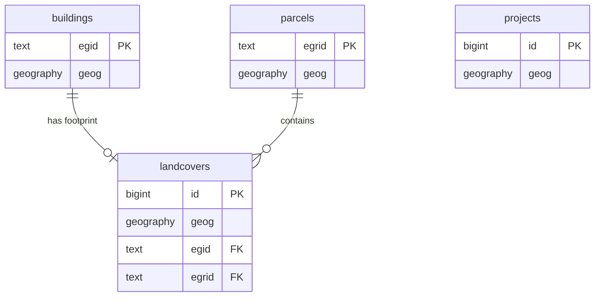

# Swiss Geodata Platform - Database Schema Design

## Project Overview

**Repository**: [swissALTI3D-Volumen](https://github.com/davras5/swissALTI3D-Volumen)
**Database**: PostGIS on Supabase
**Purpose**: Public-facing platform aggregating Swiss OGD (Open Government Data) for buildings, parcels, landcovers, and projects.

---

## Entity Relationship Overview

| Entity | Primary Key | Geometry | Description |
|--------|-------------|----------|-------------|
| `buildings` | `egid` | Point | Individual buildings with attributes from GWR, volumes from elevation models |
| `parcels` | `egrid` | Polygon | Land parcels from cadastral survey |
| `landcovers` | `id` | Polygon | Landcover polygons including building footprints |
| `projects` | `id` | Polygon | Construction projects (limited OGD availability) |

---

## Core Tables

### 1. buildings

Primary entity representing individual buildings. Uses EGID as natural key.

#### System

| Column | Type | Constraints | Source | Description |
|--------|------|-------------|--------|-------------|
| `egid` | `text` | `PRIMARY KEY` | GWR | Eidgenössischer Gebäudeidentifikator |
| `geog` | `geography(POINT, 4326)` | | GWR | Building centroid |
| `created_at` | `timestamptz` | `DEFAULT NOW()` | System | Record creation timestamp |
| `updated_at` | `timestamptz` | `DEFAULT NOW()` | System | Record last update timestamp |

#### Address

| Column | Type | Constraints | Source | Description |
|--------|------|-------------|--------|-------------|
| `street` | `text` | | GWR | Street name |
| `house_nr` | `text` | | GWR | House number |
| `postal_code` | `text` | | GWR | Postal code |
| `city` | `text` | | GWR | City/locality |
| `region` | `text` | | GWR | Region code (canton in CH) |

#### Classification

| Column | Type | Constraints | Source | Description |
|--------|------|-------------|--------|-------------|
| `status` | `text` | | GWR | Building status (planned, under construction, existing, demolished) |
| `category` | `text` | | GWR | Building category |
| `class` | `text` | | GWR | Building class |

#### Construction

| Column | Type | Constraints | Source | Description |
|--------|------|-------------|--------|-------------|
| `construction_year` | `integer` | | GWR | Year of construction |
| `renovation_year` | `integer` | | GWR | Year of last renovation |
| `floors_above` | `integer` | | GWR | Number of floors above ground |
| `floors_below` | `integer` | | GWR | Number of floors below ground |
| `dwellings_count` | `integer` | | GWR | Number of dwellings |

#### Dimensions

| Column | Type | Constraints | Source | Description |
|--------|------|-------------|--------|-------------|
| `volume_total_m3` | `numeric` | | Derived | Total building volume |
| `volume_above_ground_m3` | `numeric` | | Derived | Volume above ground |
| `elevation_base_m` | `numeric` | | swissALTI3D | Terrain elevation at base |
| `height_mean_m` | `numeric` | | Derived | Mean building height |
| `height_max_m` | `numeric` | | Derived | Maximum building height |

#### Energy

| Column | Type | Constraints | Source | Description |
|--------|------|-------------|--------|-------------|
| `heating_type` | `text` | | GWR | Heating system type |
| `heating_source` | `text` | | GWR | Heating energy source |
| `water_heating_type` | `text` | | GWR | Hot water system type |
| `water_heating_source` | `text` | | GWR | Hot water energy source |

#### Administrative

| Column | Type | Constraints | Source | Description |
|--------|------|-------------|--------|-------------|
| `municipality_nr` | `integer` | | GWR | BFS municipality number |
| `municipality_name` | `text` | | GWR | Municipality name |

#### Heritage

| Column | Type | Constraints | Source | Description |
|--------|------|-------------|--------|-------------|
| `heritage_category` | `text` | | KGS | Protection category (A/B) |
| `heritage_inventory_nr` | `integer` | | KGS | Inventory number |

#### Zoning

| Column | Type | Constraints | Source | Description |
|--------|------|-------------|--------|-------------|
| `zone_designation` | `text` | | ARE | Zoning designation |
| `zone_usage` | `text` | | ARE | Permitted zone usage |

---

### 2. parcels

Land parcels from the official cadastral survey (Amtliche Vermessung).

#### System

| Column | Type | Constraints | Source | Description |
|--------|------|-------------|--------|-------------|
| `egrid` | `text` | `PRIMARY KEY` | AV | Eidgenössischer Grundstückidentifikator |
| `geog` | `geography(POLYGON, 4326)` | | AV | Parcel geometry |
| `created_at` | `timestamptz` | `DEFAULT NOW()` | System | Record creation timestamp |
| `updated_at` | `timestamptz` | `DEFAULT NOW()` | System | Record last update timestamp |

#### Identification

| Column | Type | Constraints | Source | Description |
|--------|------|-------------|--------|-------------|
| `parcel_nr` | `text` | | AV | Parcel number (per municipality) |
| `municipality_nr` | `integer` | | AV | BFS municipality number |
| `municipality_name` | `text` | | AV | Municipality name |

#### Dimensions

| Column | Type | Constraints | Source | Description |
|--------|------|-------------|--------|-------------|
| `area_parcel_m2` | `numeric` | | AV | Total parcel area |
| `area_footprint_m2` | `numeric` | | Derived | Sum of building footprints |
| `area_surrounding_m2` | `numeric` | | Derived | Surrounding area (non-built) |
| `area_sealed_m2` | `numeric` | | Derived | Sealed/impervious area |

#### Zoning

| Column | Type | Constraints | Source | Description |
|--------|------|-------------|--------|-------------|
| `zone_designation` | `text` | | ARE | Zoning designation |
| `zone_usage` | `text` | | ARE | Permitted zone usage |

---

### 3. landcovers

Landcover polygons from Amtliche Vermessung. Building footprints are a specific type.

#### System

| Column | Type | Constraints | Source | Description |
|--------|------|-------------|--------|-------------|
| `id` | `bigint` | `PRIMARY KEY, GENERATED ALWAYS AS IDENTITY` | System | System ID |
| `geog` | `geography(POLYGON, 4326)` | | AV | Landcover geometry |
| `created_at` | `timestamptz` | `DEFAULT NOW()` | System | Record creation timestamp |
| `updated_at` | `timestamptz` | `DEFAULT NOW()` | System | Record last update timestamp |

#### Classification

| Column | Type | Constraints | Source | Description |
|--------|------|-------------|--------|-------------|
| `type` | `text` | `NOT NULL` | AV | Landcover type (building, road, water, etc.) |
| `egid` | `text` | | AV | Building EGID (for building footprints only) |
| `egrid` | `text` | | AV | Associated parcel EGRID |

#### Dimensions

| Column | Type | Constraints | Source | Description |
|--------|------|-------------|--------|-------------|
| `area_m2` | `numeric` | | Derived | Surface area |
| `volume_total_m3` | `numeric` | | Derived | Volume (for buildings) |
| `height_mean_m` | `numeric` | | Derived | Mean height (for buildings) |
| `height_max_m` | `numeric` | | Derived | Maximum height (for buildings) |

---

### 4. projects

Construction projects. Note: Limited OGD available - primarily cantonal building permit data where published.

#### System

| Column | Type | Constraints | Source | Description |
|--------|------|-------------|--------|-------------|
| `id` | `bigint` | `PRIMARY KEY, GENERATED ALWAYS AS IDENTITY` | System | System ID |
| `geog` | `geography(POLYGON, 4326)` | | Various | Project perimeter |
| `created_at` | `timestamptz` | `DEFAULT NOW()` | System | Record creation timestamp |
| `updated_at` | `timestamptz` | `DEFAULT NOW()` | System | Record last update timestamp |

#### Identification

| Column | Type | Constraints | Source | Description |
|--------|------|-------------|--------|-------------|
| `name` | `text` | | Various | Project name |
| `status` | `text` | | Various | Status (planned, approved, under construction, completed) |
| `project_type` | `text` | | Various | Project type |
| `municipality_nr` | `integer` | | Various | BFS municipality number |

#### Timeline

| Column | Type | Constraints | Source | Description |
|--------|------|-------------|--------|-------------|
| `date_submission` | `date` | | Various | Building permit submission date |
| `date_approval` | `date` | | Various | Building permit approval date |
| `date_start` | `date` | | Various | Construction start date |
| `date_end` | `date` | | Various | Construction end date |

---

## Lookup Tables

### landcover_types

Standardized landcover categories.

| Column | Type | Constraints | Source | Description |
|--------|------|-------------|--------|-------------|
| `code` | `text` | `PRIMARY KEY` | AV | Type code |
| `name_de` | `text` | | AV | German name |
| `name_fr` | `text` | | AV | French name |
| `name_it` | `text` | | AV | Italian name |
| `name_en` | `text` | | Derived | English name |

### municipalities

BFS municipality register.

| Column | Type | Constraints | Source | Description |
|--------|------|-------------|--------|-------------|
| `bfs_nr` | `integer` | `PRIMARY KEY` | BFS | BFS number |
| `name` | `text` | | BFS | Municipality name |
| `region` | `text` | | BFS | Region code (canton in CH) |
| `district` | `text` | | BFS | District name |

---

## Implementation Phases

### Phase 1

1. **Buildings** with GWR data + calculated volumes from swissALTI3D
2. **Parcels** with AV geometry and basic attributes
3. **Landcovers** with building footprints as priority type
4. **KGS heritage data** enrichment
5. **ARE zoning data** enrichment

### Phase 2 Candidates

- Cantonal building permit data (varies by canton)
- Solar potential data (Sonnendach.ch)
- Natural hazards (Naturgefahren)
- Public transport accessibility

---

## Data Sources

| Source | Full Name | Data Provider | Access |
|--------|-----------|---------------|--------|
| AV | Amtliche Vermessung | Cantonal Survey Offices via geodienste.ch | OGD |
| GWR | Gebäude- und Wohnungsregister | BFS (Federal Statistical Office) | OGD |
| ARE | Bauzonen Schweiz | ARE (Federal Office for Spatial Development) | OGD |
| KGS | KGS Inventar | BABS (Federal Office for Civil Protection) | OGD |
| swissALTI3D | swissALTI3D | swisstopo | OGD |
| swissSURFACE3D | swissSURFACE3D | swisstopo | OGD |

### Data Sources Reference

| Dataset | API/Download | Update Frequency | Notes |
|---------|--------------|------------------|-------|
| Amtliche Vermessung | geodienste.ch WFS/Download | Varies by canton | Building footprints, parcels |
| GWR | api3.geo.admin.ch | Quarterly | Building attributes |
| swissALTI3D | swisstopo STAC/Download | Annual | Terrain model |
| swissSURFACE3D | swisstopo STAC/Download | Annual | Surface model |
| Bauzonen | opendata.swiss | Annual | Zoning data |
| KGS Inventar | opendata.swiss | Occasional | Heritage protection |
| BFS Municipalities | bfs.admin.ch | Annual | Municipality register |
