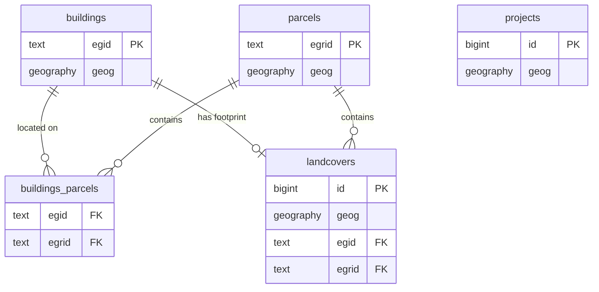

# Swiss Geodata Platform - Database Schema Design

## Project Overview

**Repository**: [swissALTI3D-Volumen](https://github.com/davras5/swissALTI3D-Volumen)
**Database**: PostGIS on Supabase
**Purpose**: Public-facing platform aggregating Swiss OGD (Open Government Data) for buildings, parcels, landcovers, and projects.

---

## Data Sources

| Source | Full Name | Data Provider | Access |
|--------|-----------|---------------|--------|
| AV | Amtliche Vermessung | Cantonal Survey Offices via geodienste.ch | OGD |
| GWR | Gebäude- und Wohnungsregister | BFS (Federal Statistical Office) | OGD |
| ARE | Bauzonen Schweiz | ARE (Federal Office for Spatial Development) | OGD |
| KGS | KGS Inventar | BABS (Federal Office for Civil Protection) | OGD |
| swissALTI3D | swissALTI3D | swisstopo | OGD |
| swissSURFACE3D | swissSURFACE3D | swisstopo | OGD |

---

## Entity Relationship Overview

---

## Core Tables

### 1. buildings

Primary entity representing individual buildings. Uses EGID as natural key.

#### System

| Column | Type | Description |
|--------|------|-------------|
| `egid` | `text PRIMARY KEY` | Eidgenössischer Gebäudeidentifikator |
| `geog` | `geography(POINT, 4326)` | Building centroid |
| `created_at` | `timestamptz` | Record creation timestamp |
| `updated_at` | `timestamptz` | Record last update timestamp |

#### Address

| Column | Type | Description |
|--------|------|-------------|
| `street` | `text` | Street name |
| `house_nr` | `text` | House number |
| `postal_code` | `text` | Postal code |
| `city` | `text` | City/locality |
| `canton` | `text` | Canton code |

#### Classification

| Column | Type | Description |
|--------|------|-------------|
| `status` | `text` | Building status (planned, under construction, existing, demolished) |
| `category` | `text` | Building category |
| `class` | `text` | Building class |

#### Construction

| Column | Type | Description |
|--------|------|-------------|
| `construction_year` | `integer` | Year of construction |
| `renovation_year` | `integer` | Year of last renovation |
| `floors_above` | `integer` | Number of floors above ground |
| `floors_below` | `integer` | Number of floors below ground |
| `dwellings_count` | `integer` | Number of dwellings |

#### Dimensions

| Column | Type | Description |
|--------|------|-------------|
| `volume_total_m3` | `numeric` | Total building volume |
| `volume_above_ground_m3` | `numeric` | Volume above ground |
| `elevation_base_m` | `numeric` | Terrain elevation at base |
| `height_mean_m` | `numeric` | Mean building height |
| `height_max_m` | `numeric` | Maximum building height |

#### Energy

| Column | Type | Description |
|--------|------|-------------|
| `heating_type` | `text` | Heating system type |
| `heating_source` | `text` | Heating energy source |
| `water_heating_type` | `text` | Hot water system type |
| `water_heating_source` | `text` | Hot water energy source |

#### Administrative

| Column | Type | Description |
|--------|------|-------------|
| `municipality_nr` | `integer` | BFS municipality number |
| `municipality_name` | `text` | Municipality name |

#### Heritage

| Column | Type | Description |
|--------|------|-------------|
| `heritage_category` | `text` | KGS protection category (A/B) |
| `heritage_inventory_nr` | `integer` | KGS inventory number |

#### Zoning

| Column | Type | Description |
|--------|------|-------------|
| `zone_designation` | `text` | Zoning designation |
| `zone_usage` | `text` | Permitted zone usage |

---

### 2. parcels

Land parcels from the official cadastral survey (Amtliche Vermessung).

#### System

| Column | Type | Description |
|--------|------|-------------|
| `egrid` | `text PRIMARY KEY` | Eidgenössischer Grundstückidentifikator |
| `geog` | `geography(POLYGON, 4326)` | Parcel geometry |
| `created_at` | `timestamptz` | Record creation timestamp |
| `updated_at` | `timestamptz` | Record last update timestamp |

#### Identification

| Column | Type | Description |
|--------|------|-------------|
| `parcel_nr` | `text` | Parcel number (per municipality) |
| `municipality_nr` | `integer` | BFS municipality number |
| `municipality_name` | `text` | Municipality name |

#### Dimensions

| Column | Type | Description |
|--------|------|-------------|
| `area_parcel_m2` | `numeric` | Total parcel area |
| `area_footprint_m2` | `numeric` | Sum of building footprints |
| `area_surrounding_m2` | `numeric` | Surrounding area (non-built) |
| `area_sealed_m2` | `numeric` | Sealed/impervious area |

#### Zoning

| Column | Type | Description |
|--------|------|-------------|
| `zone_designation` | `text` | Zoning designation |
| `zone_usage` | `text` | Permitted zone usage |

---

### 3. landcovers

Landcover polygons from Amtliche Vermessung. Building footprints are a specific type.

#### System

| Column | Type | Description |
|--------|------|-------------|
| `id` | `bigint GENERATED ALWAYS AS IDENTITY PRIMARY KEY` | System ID |
| `geog` | `geography(POLYGON, 4326)` | Landcover geometry |
| `created_at` | `timestamptz` | Record creation timestamp |
| `updated_at` | `timestamptz` | Record last update timestamp |

#### Classification

| Column | Type | Description |
|--------|------|-------------|
| `type` | `text NOT NULL` | Landcover type (building, road, water, etc.) |
| `egid` | `text` | Building EGID (for building footprints only) |
| `egrid` | `text` | Associated parcel EGRID |

#### Dimensions

| Column | Type | Description |
|--------|------|-------------|
| `area_m2` | `numeric` | Surface area |
| `volume_total_m3` | `numeric` | Volume (for buildings) |
| `height_mean_m` | `numeric` | Mean height (for buildings) |
| `height_max_m` | `numeric` | Maximum height (for buildings) |

---

### 4. projects

Construction projects. Note: Limited OGD available - primarily cantonal building permit data where published.

#### System

| Column | Type | Description |
|--------|------|-------------|
| `id` | `bigint GENERATED ALWAYS AS IDENTITY PRIMARY KEY` | System ID |
| `geog` | `geography(POLYGON, 4326)` | Project perimeter |
| `created_at` | `timestamptz` | Record creation timestamp |
| `updated_at` | `timestamptz` | Record last update timestamp |

#### Identification

| Column | Type | Description |
|--------|------|-------------|
| `name` | `text` | Project name |
| `status` | `text` | Status (planned, approved, under construction, completed) |
| `project_type` | `text` | Project type |
| `municipality_nr` | `integer` | BFS municipality number |

#### Timeline

| Column | Type | Description |
|--------|------|-------------|
| `date_submission` | `date` | Building permit submission date |
| `date_approval` | `date` | Building permit approval date |
| `date_start` | `date` | Construction start date |
| `date_end` | `date` | Construction end date |

---

## Junction Tables

### buildings_parcels

Many-to-many relationship (a building can span multiple parcels).

| Column | Type | Description |
|--------|------|-------------|
| `egid` | `text REFERENCES buildings(egid)` | Building FK |
| `egrid` | `text REFERENCES parcels(egrid)` | Parcel FK |
| PRIMARY KEY | `(egid, egrid)` | Composite PK |

---

## Lookup Tables

### landcover_types

Standardized landcover categories.

| Column | Type | Description |
|--------|------|-------------|
| `code` | `text PRIMARY KEY` | Type code |
| `name_de` | `text` | German name |
| `name_fr` | `text` | French name |
| `name_it` | `text` | Italian name |
| `name_en` | `text` | English name |

### municipalities

BFS municipality register.

| Column | Type | Description |
|--------|------|-------------|
| `bfs_nr` | `integer PRIMARY KEY` | BFS number |
| `name` | `text` | Municipality name |
| `canton` | `text` | Canton code |
| `district` | `text` | District name |

---

## Data Sources Reference

| Dataset | API/Download | Update Frequency | Notes |
|---------|--------------|------------------|-------|
| Amtliche Vermessung | geodienste.ch WFS/Download | Varies by canton | Building footprints, parcels |
| GWR | api3.geo.admin.ch | Quarterly | Building attributes |
| swissALTI3D | swisstopo STAC/Download | Annual | Terrain model |
| swissSURFACE3D | swisstopo STAC/Download | Annual | Surface model |
| Bauzonen | opendata.swiss | Annual | Zoning data |
| KGS Inventar | opendata.swiss | Occasional | Heritage protection |
| BFS Municipalities | bfs.admin.ch | Annual | Municipality register |

---

## Implementation Phases

### Phase 1

1. **Buildings** with GWR data + calculated volumes from swissALTI3D
2. **Parcels** with AV geometry and basic attributes
3. **Landcovers** with building footprints as priority type
4. **KGS heritage data** enrichment
5. **ARE zoning data** enrichment

### Phase 2 Candidates

- Cantonal building permit data (varies by canton)
- Solar potential data (Sonnendach.ch)
- Natural hazards (Naturgefahren)
- Public transport accessibility
